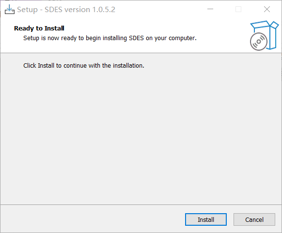

# EMQX & Watsons: SDES Agent Install

## Step 1 Download

## Step 2 Installation
Double-click to open the `sdes_client.exe` file, and then click Install to install.

## Step 3 configuration

`Emphasis: Do not use win notepad to edit, but use a professional editor, notepad++, vscode, etc.`.  
The configuration file path is `C:\Users\${USERS}\AppData\Local\Programs\SDES\config.ini`. Here ${USERS} represents the current computer user name, for example, my current computer user name is emqx.

Here, ServerAddr is the IP address of EMQX Broker, and ServerPort is the MQTT service port, which needs to be configured accordingly.