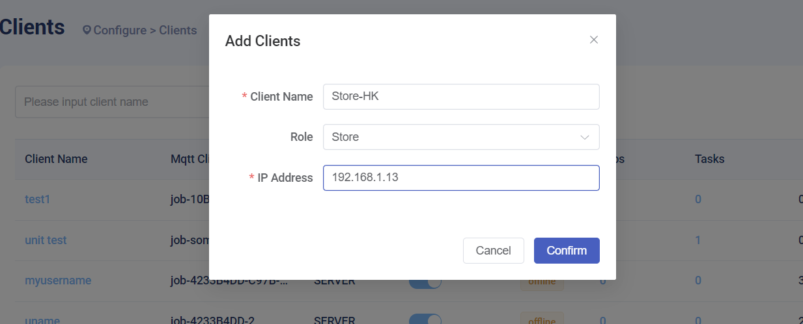
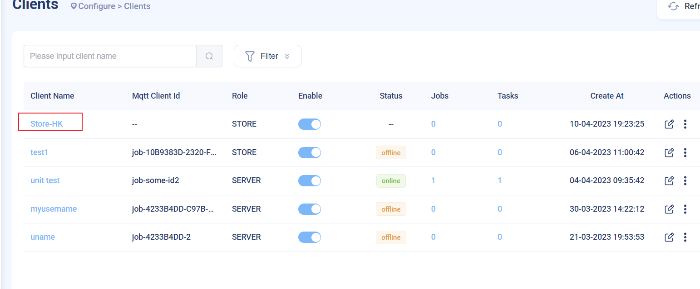
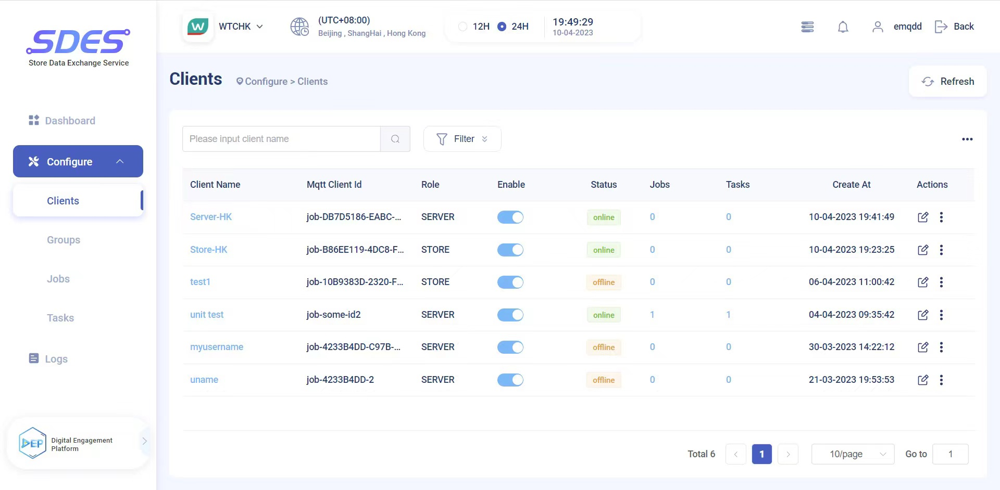

# EMQX & Watsons SDES Boot Client

## Step 1: Query the store's IP

## Step 2: Configure information on the front end, set it as store/server
On the SDES Dashboard click Add Client

Configure client information and set the role to Store.

After adding successfully, you can see the newly added client on the page.

## Step 3: Add attributes & groups

## Step 4: Install, wait for the device to complete boot activation automatically

## Step 5: How to see the device status
On the client list interface, you can see related information such as the status of the device and the online status of the role.

## Step 6: Disable the device
If you need to disable a device, you can click the button in the Enable column to close it to disable the device.