# EMQX & Watsons SDES Deploy

## Architecture Design

### EMQX Enterprise Watsons SDES customized version

Based on EMQX Enterprise Edition, custom-developed plug-ins include the following functions

- Authentication: store startup authentication (issue store information, authentication information based on IP address), connection management and authentication management after the device BOOT process
- Authentication: business process authentication, file transfer based on SDES Job management, authorization of both ends (server and store) during file transfer
- File transfer protocol: file fragmentation, integrity check, file broadcast, partition push
- Protocol control: business management, flow control, device information delivery, file transfer service delivery
- Device management plug-in: store message channel management, instant notification of online and offline

For the opening and starting of the module, please refer to the `Watsons Module` chapter.

The EMQX Enterprise version uses a three-node cluster to ensure high service availability.

### EMQX Backend API

Microservices written using the Java SpringBoot framework, RESTFul API. Serves the SDES front-end console. For detailed API interface documentation, refer to the `API docs` chapter.

### MySQL database

Provide data support for the SDES platform. For database table design, refer to `MySQL DataBase` chapter.

### Front-end interactive component SDES Dashboard

#### Function (3 sections: access, message distribution, data cache)

#### Rule engine use (just write MySQL resource configuration, log report persistence rules. Online and offline events have been transferred to the internal implementation of the plug-in)

## Architecture Diagram

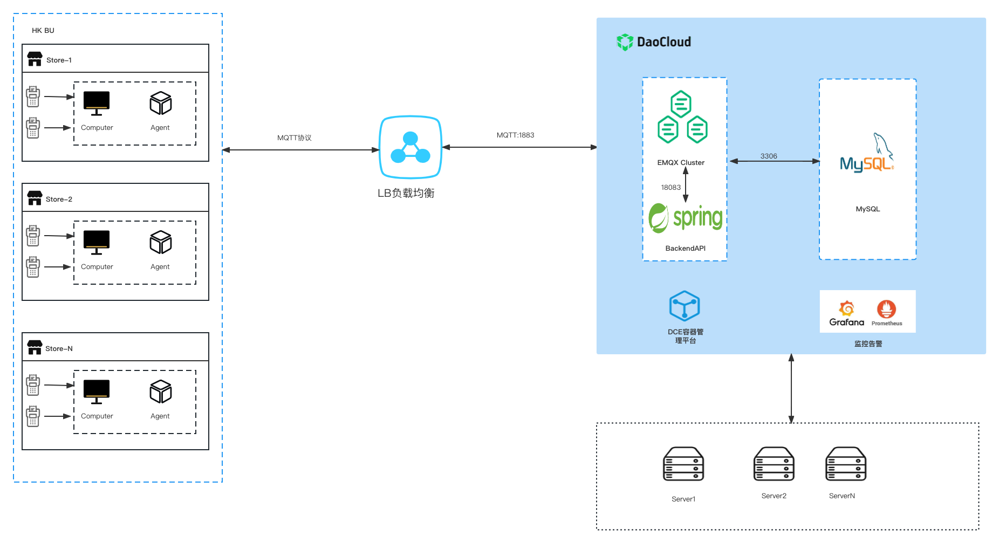

## Resource information

Resource configuration and port information are as follows

|   Services   |     Resource Configuration      | Minimum Resources | Ports                                                   |
| :----------: | :-----------------------------: | ----------------- | ------------------------------------------------------- |
| EMQX Cluster |           3 * (8c16g)           | 1c1g              | 1883 8883 8083 8084 8081 18083  |
|  BackendAPI  | API(Java SpringBoot)2 * (8c16g) | 0.5c500m          | 9000                                                    |
|    MySQL     |           1 * (8c16g)           | 1c1g              | 3306                                                    |
|   Frontent   |           2 * (1c2g)            | 0.5c500m          |                                                         |

## Start deploy

## Deploy emqx-ee

Deploying emqx-ee provides two deployment methods:

1. Deploy through helm (recommended)

2. Deploy through native Yaml.

### helm deployment

Open the daocloud platform, find the application template, click Import Template, and upload the completed helm package.

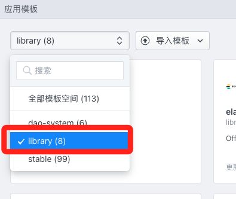

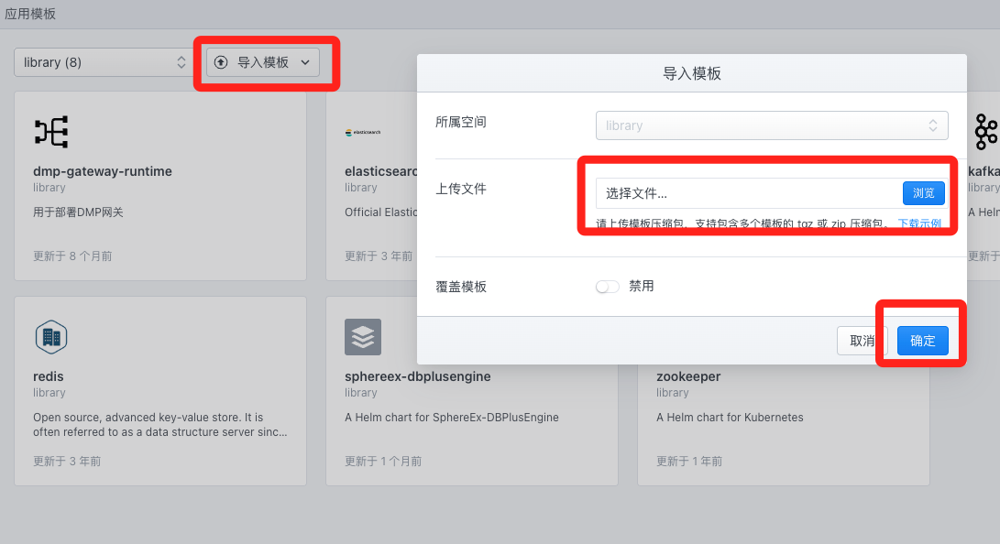

After the upload is complete, find the uploaded emqx-ee and click the deploy button to deploy.

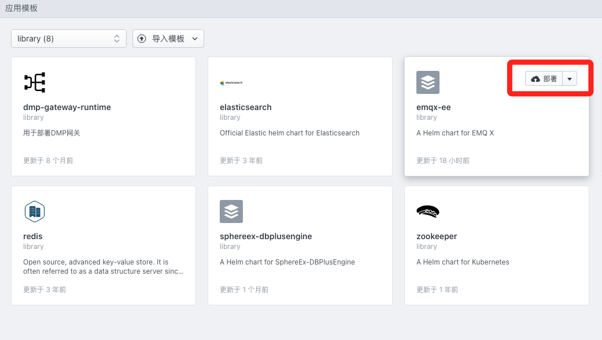

Select the version namespace application name information.

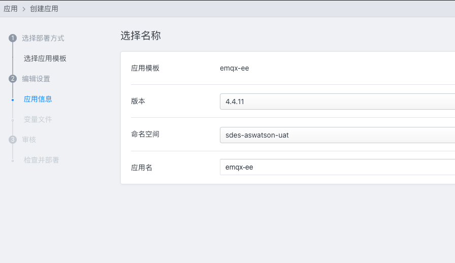

Then you can modify the repository, resource, and service type information according to actual needs, and click Deploy after the modification is complete.

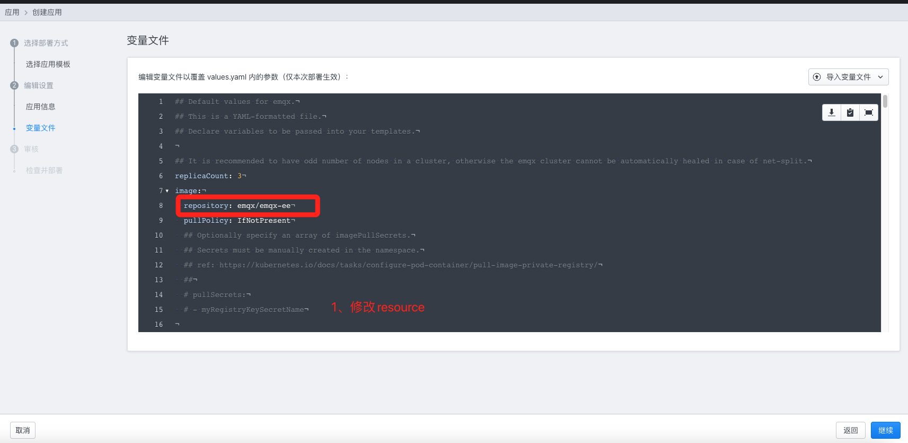

### Native Yaml deployment

Open the daocloud platform, click on the application and choose to arrange the application through YAML. Fill in the type as follows YAML file.

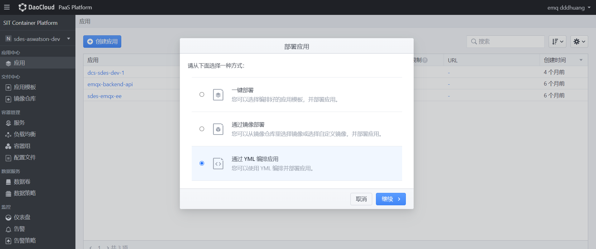

Configure and fill in the application name, and fill in the following YAML file.

The content of the yaml file for building an EMQX cluster is as follows:

~~~yaml
---
# create ns emqx
apiVersion: v1
kind: Namespace
metadata:
  labels:
    kubernetes.io/metadata.name: emqx-ee
  name: emqx-ee
---
# Source: rbac.yaml
apiVersion: v1
kind: ServiceAccount
metadata:
  namespace: emqx-ee
  name: emqx-ee

---
# rbac.yaml
kind: Role
apiVersion: rbac.authorization.k8s.io/v1
metadata:
  namespace: emqx-ee
  name: emqx-ee
rules:
- apiGroups:
  - ""
  resources:
  - endpoints 
  verbs: 
  - get
  - watch
  - list
---
# rbac.yaml
kind: RoleBinding
apiVersion: rbac.authorization.k8s.io/v1
metadata:
  namespace: emqx-ee
  name: emqx-ee
subjects:
  - kind: ServiceAccount
    name: emqx-ee
    namespace: emqx-ee
roleRef:
  kind: Role
  name: emqx-ee
  apiGroup: rbac.authorization.k8s.io  

---
# Source: configmap.yaml
apiVersion: v1
kind: ConfigMap
metadata:
  name: emqx-ee-env
  namespace: emqx-ee
  labels:
    app.kubernetes.io/name: emqx-ee
     
data:
    EMQX_CLUSTER__K8S__ADDRESS_TYPE: "hostname"
    EMQX_CLUSTER__K8S__APISERVER: "https://kubernetes.default.svc:443"
    EMQX_CLUSTER__K8S__SUFFIX: "svc.cluster.local"
    EMQX_LOG__TO: "both"
    EMQX_LOG__LEVEL: "error"
    EMQX_dashboard__default_user__login: "admin"
    EMQX_dashboard__default_user__password: "emqxa303."
   
---
# service.yaml
apiVersion: v1
kind: Service
metadata:
  name: emqx-ee
  namespace: emqx-ee
  labels:
    app.kubernetes.io/name: emqx-ee
       
spec:
  type: NodePort
  ports:
  - name: mqtt
    port: 1883
    protocol: TCP
    targetPort: mqtt
  - name: mqttssl
    port: 8883
    protocol: TCP
    targetPort: mqttssl
  - name: mgmt
    port: 8081
    protocol: TCP
    targetPort: mgmt
  - name: ws
    port: 8083
    protocol: TCP
    targetPort: ws
  - name: wss
    port: 8084
    protocol: TCP
    targetPort: wss
  - name: dashboard
    port: 18083
    protocol: TCP
    targetPort: dashboard
  selector:
    app.kubernetes.io/name: emqx-ee
    
---
# service.yaml
apiVersion: v1
kind: Service
metadata:
  name: emqx-ee-headless
  namespace: emqx-ee
  labels:
    app.kubernetes.io/name: emqx-ee
       
spec:
  type: ClusterIP
  publishNotReadyAddresses: true
  sessionAffinity: None
  clusterIP: None
  ports:
  - name: mqtt
    port: 1883
    protocol: TCP
    targetPort: mqtt
  - name: mqttssl
    port: 8883
    protocol: TCP
    targetPort: mqttssl
  - name: mgmt
    port: 8081
    protocol: TCP
    targetPort: mgmt
  - name: ws
    port: 8083
    protocol: TCP
    targetPort: ws
  - name: wss
    port: 8084
    protocol: TCP
    targetPort: wss
  - name: dashboard
    port: 18083
    protocol: TCP
    targetPort: dashboard
  - name: ekka
    port: 4370
    protocol: TCP
    targetPort: ekka
  selector:
    app.kubernetes.io/name: emqx-ee
    
---
# StatefulSet.yaml
apiVersion: apps/v1
kind: StatefulSet
metadata:
  name: emqx-ee
  namespace: emqx-ee
  labels:
    app.kubernetes.io/name: emqx-ee
        
spec:
  serviceName: emqx-ee-headless
  podManagementPolicy: Parallel 
  
  updateStrategy:
    type: RollingUpdate 
  
  replicas: 3
  selector:
    matchLabels:
      app.kubernetes.io/name: emqx-ee
      
  template:
    metadata:
      labels:
        app: emqx-ee
        version: Watsons
        app.kubernetes.io/name: emqx-ee
        
    spec:
      volumes:
     
      - name: host-time
        hostPath: 
          path: /etc/localtime
      serviceAccountName:  emqx-ee
      
      containers:
        - name: emqx
          image: "10.95.35.98/emqx/emqx-ee:202304261421"
          imagePullPolicy: IfNotPresent
          
         
          ports:
          - name: mqtt
            containerPort: 1883
          - name: mqttssl
            containerPort: 8883
          - name: mgmt
            containerPort: 8081
          - name: ws
            containerPort: 8083
          - name: wss
            containerPort: 8084
          - name: dashboard
            containerPort: 18083
          - name: ekka
            containerPort: 4370
          envFrom:
            - configMapRef:
                name: emqx-ee-env
          env:
          - name: EMQX_NAME
            value: emqx
          - name: EMQX_CLUSTER__K8S__APP_NAME
            value: emqx
          - name: EMQX_CLUSTER__DISCOVERY
            value: k8s
          - name: EMQX_CLUSTER__K8S__SERVICE_NAME
            value: emqx-ee-headless
          - name: EMQX_CLUSTER__K8S__NAMESPACE
            value: emqx-ee
          resources: {}
          volumeMounts:
          - name: host-time
            mountPath: /etc/localtime
          
          readinessProbe:
            httpGet:
              path: /status
              port: 8081
            initialDelaySeconds: 10
            periodSeconds: 5
            failureThreshold: 30
            
          livenessProbe:
            httpGet:
              path: /status
              port: 8081
            initialDelaySeconds: 60
            periodSeconds: 30
            failureThreshold: 10  
~~~
Note that `namespace: emqx-ee` needs to be modified to the corresponding k8S namespace, and the value corresponding to `EMQX_CLUSTER__K8S__NAMESPACE` should also be modified to the corresponding namespace. The image name and image tag need to be changed to `image: "10.95.35.98/emqx/emqx-ee:202304261421"` corresponding to the private warehouse. YAML specifies the default password `emqxa303.` of the EMQX Dashboard user through configmap.

After the configuration is complete, you can see the service port information corresponding to the application through the Daocloud page, and you can see the corresponding relationship as follows.

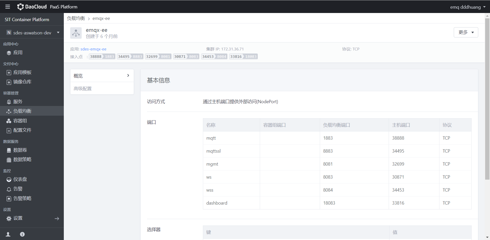

### Log in to EMQX background management Dashboard

Account and password, the password is the password set above

~~~shell
admin/emqxa303.
~~~

### Restore EMQX configuration

There are two main methods

1. Restore by modifying the backup json and importing it (recommended).

2. Manually configure on the dashboard page.

### import json recovery

The full json file looks like this
~~~json
{
    "version": "4.4",
    "rules": [
        {
            "id": "rule:911673",
            "rawsql": "SELECT\n    payload.report_id as report_id,\n    payload.status as job_status,\n    payload.start_time as start_time,\n    payload.end_time as end_time,\n    payload.now as script_now,\n    payload.job_id as job_id,\n    payload.task_id as task_id,\n    payload.script_id as script_id,\n    payload.order as script_order,\n    payload.type as script_type,\n    payload.error_code as error_code,\n    payload.message as script_error_message,\n    clientid as client_id\nFROM\n    '$report/job/+/task/+'",
            "actions": [
                {
                    "id": "data_to_mysql_1678601756022978870",
                    "name": "data_to_mysql",
                    "fallbacks": [],
                    "args": {
                        "sync_timeout": 5000,
                        "sql": "INSERT INTO\n    job_logs (\n        `status`,\n        start_time,\n        end_time,\n        now_time,\n        job_id,\n        task_id,\n        script_id,\n        `order`,\n        error_code,\n        `error_message`,\n        mqtt_client_id,\n        report_id,\n        script_type\n    )\nVALUES\n(\n    ${job_status},\n    ${start_time},\n    ${end_time},\n    ${script_now},\n    ${job_id},\n    ${task_id},\n    ${script_id},\n    ${script_order},\n    ${error_code},\n    ${script_error_message},\n    ${client_id},\n    ${report_id},\n    ${script_type}\n    );",
                        "insert_mode": "async",
                        "enable_batch": true,
                        "batch_time": 10,
                        "batch_size": 100,
                        "$resource": "resource:947678"
                    }
                }
            ],
            "enabled": true,
            "description": "Job log report"
        },
        {
            "id": "rule:458783",
            "rawsql": "SELECT \nclientid, \nusername,\nformat_date('millisecond', 0, '%Y-%m-%d %H:%M:%S%:z',connected_at) as connected_at\nFROM \n\"$events/client_connected\"",
            "actions": [
                {
                    "id": "data_to_mysql_1678601787360224313",
                    "name": "data_to_mysql",
                    "fallbacks": [],
                    "args": {
                        "sql": "INSERT INTO \nclients(mqtt_client_id, user_name, status,connected_at) \nVALUES(${clientid}, ${username}, 'online', ${connected_at})\nON DUPLICATE KEY UPDATE status='online',connected_at=${connected_at};",
                        "enable_batch": false,
                        "$resource": "resource:947678"
                    }
                }
            ],
            "enabled": false,
            "description": "Online message"
        },
        {
            "id": "rule:199804",
            "rawsql": "SELECT \nclientid,\nformat_date('millisecond', 0, '%Y-%m-%d %H:%M:%S%:z',disconnected_at) as disconnected_at \nFROM \n\"$events/client_disconnected\"",
            "actions": [
                {
                    "id": "data_to_mysql_1678601804182431479",
                    "name": "data_to_mysql",
                    "fallbacks": [],
                    "args": {
                        "sql": "UPDATE clients\nSET status='offline', disconnected_at = ${disconnected_at}\nWHERE mqtt_client_id=${clientid};",
                        "enable_batch": false,
                        "$resource": "resource:947678"
                    }
                }
            ],
            "enabled": false,
            "description": "Offline message"
        }
    ],
    "resources": [
        {
            "id": "resource:947678",
            "type": "backend_mysql",
            "config": {
                "auto_reconnect": true,
                "cacertfile": {
                    "filename": "",
                    "file": ""
                },
                "certfile": {
                    "filename": "",
                    "file": ""
                },
                "database": "sdes_asia",
                "keyfile": {
                    "filename": "",
                    "file": ""
                },
                "password": "n^vSUb6MAM",
                "pool_size": 8,
                "server": "10.95.35.226:3306",
                "ssl": false,
                "user": "u_sdes_asia",
                "verify": false
            },
            "created_at": 1682495481559,
            "description": ""
        }
    ],
    "blacklist": [],
    "apps": [
        {
            "id": "admin",
            "secret": "public",
            "name": "Default",
            "desc": "Application user",
            "status": true,
            "expired": "undefined"
        }
    ],
    "users": [
        {
            "username": "admin",
            "password": "BAMiqEweLr7gmM+i9IZpnsOVTtE=",
            "tags": "administrator"
        },
        {
            "username": "ddd",
            "password": "TZR+FPpRCsqaEdqiJVP3itXEzHE=",
            "tags": ""
        }
    ],
    "auth_mnesia": [],
    "acl_mnesia": [],
    "modules": [
        {
            "id": "module:58d766d2",
            "type": "prometheus",
            "config": {
                "url": "http://10.95.35.93:39762",
                "interval": "15s"
            },
            "enabled": true,
            "created_at": 1682495481616,
            "description": ""
        },
        {
            "id": "module:4814a68c",
            "type": "internal_acl",
            "config": {
                "acl_rule_file": {
                    "filename": "acl.conf",
                    "file": "{allow, {user, \"dashboard\"}, subscribe, [\"$SYS/#\"]}.\n{allow, {ipaddr, \"127.0.0.1\"}, pubsub, [\"$SYS/#\", \"#\"]}.\n{deny, all, subscribe, [\"$SYS/#\", {eq, \"#\"}]}.\n{allow, all}.\n"
                }
            },
            "enabled": true,
            "created_at": 1673836325184,
            "description": ""
        },
        {
            "id": "module:22196f43",
            "type": "presence",
            "config": {
                "qos": 0
            },
            "enabled": true,
            "created_at": 1673836325184,
            "description": ""
        },
        {
            "id": "module:64091203",
            "type": "retainer",
            "config": {
                "storage_type": "ram",
                "max_retained_messages": 0,
                "max_payload_size": "1MB",
                "expiry_interval": 0
            },
            "enabled": true,
            "created_at": 1673836325184,
            "description": ""
        },
        {
            "id": "module:3df086f6",
            "type": "watsons",
            "config": {
                "mysql_username": "u_sdes_asia",
                "mysql_server": "10.95.35.226:3306",
                "mysql_pwd": "n^vSUb6MAM",
                "mysql_database": "sdes_asia"
            },
            "enabled": true,
            "created_at": 1682495481623,
            "description": ""
        },
        {
            "id": "module:58d274fb",
            "type": "recon",
            "config": {},
            "enabled": true,
            "created_at": 1673836325184,
            "description": ""
        }
    ],
    "schemas": [],
    "configs": [
        {
            "name": "license",
            "confs": {
                "connection_high_watermark_alarm": "80%",
                "connection_low_watermark_alarm": "75%"
            }
        },
        {
            "type": "tcp",
            "name": "internal",
            "confs": {
                "acceptors": "4",
                "active_n": "1000",
                "backlog": "512",
                "listener": "127.0.0.1:11883",
                "max_conn_rate": "1000",
                "max_connections": "1024000",
                "nodelay": "false",
                "peer_cert_as_clientid": "null",
                "peer_cert_as_username": "null",
                "proxy_protocol": "null",
                "proxy_protocol_timeout": "null",
                "recbuf": "64KB",
                "reuseaddr": "true",
                "send_timeout": "5s",
                "send_timeout_close": "on",
                "sndbuf": "64KB",
                "zone": "internal"
            }
        },
        {
            "type": "tcp",
            "name": "external",
            "confs": {
                "acceptors": "8",
                "active_n": "100",
                "backlog": "1024",
                "listener": "0.0.0.0:1883",
                "max_conn_rate": "1000",
                "max_connections": "1024000",
                "nodelay": "true",
                "peer_cert_as_clientid": "null",
                "peer_cert_as_username": "null",
                "proxy_protocol": "null",
                "proxy_protocol_timeout": "null",
                "recbuf": "null",
                "reuseaddr": "true",
                "send_timeout": "15s",
                "send_timeout_close": "on",
                "sndbuf": "null",
                "zone": "external"
            }
        },
        {
            "zone": "internal",
            "confs": {
                "allow_anonymous": "true",
                "exclusive_subscription": "null",
                "max_topic_alias": "null",
                "enable_stats": "on",
                "quota_overall_messages_routing": "null",
                "use_username_as_clientid": "null",
                "quota_conn_messages_routing": "null",
                "idle_timeout": "null",
                "latency_samples": "null",
                "acl_deny_action": "ignore",
                "publish_limit": "null",
                "mqueue_store_qos0": "true",
                "force_shutdown_policy": "null",
                "session_expiry_interval": "null",
                "bypass_auth_plugins": "true",
                "keepalive_backoff": "null",
                "enable_flapping_detect": "off",
                "upgrade_qos": "null",
                "conn_congestion_min_alarm_sustain_duration": "null",
                "mqueue_priorities": "null",
                "rate_limit_conn_messages_in": "null",
                "strict_mode": "false",
                "shared_subscription": "null",
                "server_keepalive": "null",
                "wildcard_subscription": "null",
                "max_clientid_len": "null",
                "response_information": "null",
                "mountpoint": "null",
                "max_awaiting_rel": "1000",
                "acl_nomatch": "null",
                "retry_interval": "null",
                "retain_available": "null",
                "ignore_loop_deliver": "false",
                "enable_acl": "off",
                "max_qos_allowed": "null",
                "rate_limit_conn_bytes_in": "null",
                "max_mqueue_len": "10000",
                "max_topic_levels": "null",
                "max_subscriptions": "0",
                "force_gc_policy": "null",
                "mqueue_default_priority": "null",
                "max_inflight": "128",
                "conn_congestion_alarm": "null",
                "enable_ban": "null",
                "await_rel_timeout": "null",
                "max_packet_size": "null"
            }
        },
        {
            "name": "emqx",
            "confs": {
                "acl_cache_max_size": "32",
                "acl_cache_ttl": "1m",
                "acl_deny_action": "ignore",
                "acl_nomatch": "allow",
                "acl_order": "none",
                "allow_anonymous": "true",
                "auth_order": "none",
                "broker_session_locking_strategy": "quorum",
                "broker_shared_dispatch_ack_enabled": "false",
                "broker_shared_subscription_strategy": "random",
                "broker_sys_heartbeat": "30s",
                "broker_sys_interval": "1m",
                "enable_acl_cache": "on",
                "flapping_detect_policy": "30, 1m, 5m",
                "mqtt_exclusive_subscription": "false",
                "mqtt_ignore_loop_deliver": "false",
                "mqtt_max_clientid_len": "65535",
                "mqtt_max_packet_size": "1MB",
                "mqtt_max_qos_allowed": "2",
                "mqtt_max_topic_alias": "65535",
                "mqtt_max_topic_levels": "128",
                "mqtt_retain_available": "true",
                "mqtt_shared_subscription": "true",
                "mqtt_strict_mode": "false",
                "mqtt_wildcard_subscription": "true"
            }
        },
        {
            "type": "wss",
            "name": "external",
            "confs": {
                "cacertfile": "null",
                "mqtt_piggyback": "multiple",
                "send_timeout_close": "on",
                "ciphers": "TLS_AES_256_GCM_SHA384,TLS_AES_128_GCM_SHA256,TLS_CHACHA20_POLY1305_SHA256,TLS_AES_128_CCM_SHA256,TLS_AES_128_CCM_8_SHA256,ECDHE-ECDSA-AES256-GCM-SHA384,ECDHE-RSA-AES256-GCM-SHA384,ECDHE-ECDSA-AES256-SHA384,ECDHE-RSA-AES256-SHA384,ECDHE-ECDSA-DES-CBC3-SHA,ECDH-ECDSA-AES256-GCM-SHA384,ECDH-RSA-AES256-GCM-SHA384,ECDH-ECDSA-AES256-SHA384,ECDH-RSA-AES256-SHA384,DHE-DSS-AES256-GCM-SHA384,DHE-DSS-AES256-SHA256,AES256-GCM-SHA384,AES256-SHA256,ECDHE-ECDSA-AES128-GCM-SHA256,ECDHE-RSA-AES128-GCM-SHA256,ECDHE-ECDSA-AES128-SHA256,ECDHE-RSA-AES128-SHA256,ECDH-ECDSA-AES128-GCM-SHA256,ECDH-RSA-AES128-GCM-SHA256,ECDH-ECDSA-AES128-SHA256,ECDH-RSA-AES128-SHA256,DHE-DSS-AES128-GCM-SHA256,DHE-DSS-AES128-SHA256,AES128-GCM-SHA256,AES128-SHA256,ECDHE-ECDSA-AES256-SHA,ECDHE-RSA-AES256-SHA,DHE-DSS-AES256-SHA,ECDH-ECDSA-AES256-SHA,ECDH-RSA-AES256-SHA,AES256-SHA,ECDHE-ECDSA-AES128-SHA,ECDHE-RSA-AES128-SHA,DHE-DSS-AES128-SHA,ECDH-ECDSA-AES128-SHA,ECDH-RSA-AES128-SHA,AES128-SHA",
                "idle_timeout": "null",
                "depth": "null",
                "sndbuf": "null",
                "proxy_protocol": "null",
                "recbuf": "null",
                "tls_versions": "null",
                "honor_cipher_order": "null",
                "check_origins": "https://localhost:8084, https://127.0.0.1:8084",
                "acceptors": "4",
                "max_connections": "102400",
                "proxy_address_header": "null",
                "zone": "external",
                "nodelay": "null",
                "fail_if_no_peer_cert": "null",
                "verify": "null",
                "mqtt_path": "/mqtt",
                "reuse_sessions": "null",
                "proxy_port_header": "null",
                "fail_if_no_subprotocol": "null",
                "proxy_protocol_timeout": "null",
                "check_origin_enable": "false",
                "allow_origin_absence": "true",
                "peer_cert_as_username": "null",
                "log_level": "null",
                "send_timeout": "15s",
                "supported_subprotocols": "null",
                "certfile": "etc/certs/cert.pem",
                "key_password": "null",
                "keyfile": "etc/certs/key.pem",
                "active_n": "100",
                "peer_cert_as_clientid": "null",
                "psk_ciphers": "null",
                "listener": "8084",
                "dhfile": "null",
                "backlog": "1024",
                "max_conn_rate": "1000",
                "secure_renegotiate": "null",
                "max_frame_size": "null"
            }
        },
        {
            "type": "ssl",
            "name": "external",
            "confs": {
                "cacertfile": "etc/certs/cacert.pem",
                "ocsp_responder_url": "null",
                "reuseaddr": "true",
                "send_timeout_close": "null",
                "ciphers": "TLS_AES_256_GCM_SHA384,TLS_AES_128_GCM_SHA256,TLS_CHACHA20_POLY1305_SHA256,TLS_AES_128_CCM_SHA256,TLS_AES_128_CCM_8_SHA256,ECDHE-ECDSA-AES256-GCM-SHA384,ECDHE-RSA-AES256-GCM-SHA384,ECDHE-ECDSA-AES256-SHA384,ECDHE-RSA-AES256-SHA384,ECDHE-ECDSA-DES-CBC3-SHA,ECDH-ECDSA-AES256-GCM-SHA384,ECDH-RSA-AES256-GCM-SHA384,ECDH-ECDSA-AES256-SHA384,ECDH-RSA-AES256-SHA384,DHE-DSS-AES256-GCM-SHA384,DHE-DSS-AES256-SHA256,AES256-GCM-SHA384,AES256-SHA256,ECDHE-ECDSA-AES128-GCM-SHA256,ECDHE-RSA-AES128-GCM-SHA256,ECDHE-ECDSA-AES128-SHA256,ECDHE-RSA-AES128-SHA256,ECDH-ECDSA-AES128-GCM-SHA256,ECDH-RSA-AES128-GCM-SHA256,ECDH-ECDSA-AES128-SHA256,ECDH-RSA-AES128-SHA256,DHE-DSS-AES128-GCM-SHA256,DHE-DSS-AES128-SHA256,AES128-GCM-SHA256,AES128-SHA256,ECDHE-ECDSA-AES256-SHA,ECDHE-RSA-AES256-SHA,DHE-DSS-AES256-SHA,ECDH-ECDSA-AES256-SHA,ECDH-RSA-AES256-SHA,AES256-SHA,ECDHE-ECDSA-AES128-SHA,ECDHE-RSA-AES128-SHA,DHE-DSS-AES128-SHA,ECDH-ECDSA-AES128-SHA,ECDH-RSA-AES128-SHA,AES128-SHA",
                "hibernate_after": "null",
                "depth": "null",
                "handshake_timeout": "15s",
                "sndbuf": "4KB",
                "proxy_protocol": "null",
                "gc_after_handshake": "null",
                "ocsp_issuer_pem": "null",
                "recbuf": "4KB",
                "tls_versions": "null",
                "honor_cipher_order": "null",
                "acceptors": "16",
                "enable_crl_check": "null",
                "max_connections": "102400",
                "zone": "external",
                "nodelay": "null",
                "fail_if_no_peer_cert": "null",
                "verify": "null",
                "reuse_sessions": "null",
                "proxy_protocol_timeout": "null",
                "ocsp_refresh_interval": "null",
                "peer_cert_as_username": "null",
                "log_level": "null",
                "send_timeout": "null",
                "certfile": "etc/certs/cert.pem",
                "key_password": "null",
                "keyfile": "etc/certs/key.pem",
                "active_n": "100",
                "peer_cert_as_clientid": "null",
                "psk_ciphers": "null",
                "crl_cache_urls": "null",
                "listener": "8883",
                "dhfile": "null",
                "backlog": "null",
                "max_conn_rate": "500",
                "secure_renegotiate": "null",
                "enable_ocsp_stapling": "null",
                "ocsp_refresh_http_timeout": "null"
            }
        },
        {
            "type": "ws",
            "name": "external",
            "confs": {
                "acceptors": "4",
                "active_n": "100",
                "allow_origin_absence": "true",
                "backlog": "1024",
                "check_origin_enable": "false",
                "check_origins": "http://localhost:18083, http://127.0.0.1:18083",
                "fail_if_no_subprotocol": "null",
                "idle_timeout": "null",
                "listener": "8083",
                "max_conn_rate": "1000",
                "max_connections": "102400",
                "max_frame_size": "null",
                "mqtt_path": "/mqtt",
                "mqtt_piggyback": "multiple",
                "nodelay": "true",
                "peer_cert_as_clientid": "null",
                "peer_cert_as_username": "null",
                "proxy_address_header": "null",
                "proxy_port_header": "null",
                "proxy_protocol": "null",
                "proxy_protocol_timeout": "null",
                "recbuf": "null",
                "send_timeout": "15s",
                "send_timeout_close": "on",
                "sndbuf": "null",
                "supported_subprotocols": "null",
                "zone": "external"
            }
        },
        {
            "name": "vm_mon",
            "confs": {
                "check_interval": "30s",
                "process_high_watermark": "80%",
                "process_low_watermark": "60%"
            }
        },
        {
            "zone": "external",
            "confs": {
                "allow_anonymous": "null",
                "exclusive_subscription": "null",
                "max_topic_alias": "null",
                "enable_stats": "on",
                "quota_overall_messages_routing": "null",
                "use_username_as_clientid": "false",
                "quota_conn_messages_routing": "null",
                "idle_timeout": "15s",
                "latency_samples": "null",
                "acl_deny_action": "ignore",
                "publish_limit": "null",
                "mqueue_store_qos0": "true",
                "force_shutdown_policy": "null",
                "session_expiry_interval": "2h",
                "bypass_auth_plugins": "null",
                "keepalive_backoff": "0.75",
                "enable_flapping_detect": "off",
                "upgrade_qos": "off",
                "conn_congestion_min_alarm_sustain_duration": "null",
                "mqueue_priorities": "none",
                "rate_limit_conn_messages_in": "null",
                "strict_mode": "false",
                "shared_subscription": "null",
                "server_keepalive": "null",
                "wildcard_subscription": "null",
                "max_clientid_len": "null",
                "response_information": "null",
                "mountpoint": "null",
                "max_awaiting_rel": "100",
                "acl_nomatch": "null",
                "retry_interval": "30s",
                "retain_available": "null",
                "ignore_loop_deliver": "false",
                "enable_acl": "on",
                "max_qos_allowed": "null",
                "rate_limit_conn_bytes_in": "null",
                "max_mqueue_len": "1000",
                "max_topic_levels": "null",
                "max_subscriptions": "0",
                "force_gc_policy": "16000|16MB",
                "mqueue_default_priority": "highest",
                "max_inflight": "32",
                "conn_congestion_alarm": "null",
                "enable_ban": "on",
                "await_rel_timeout": "300s",
                "max_packet_size": "null"
            }
        },
        {
            "name": "os_mon",
            "confs": {
                "cpu_check_interval": "60s",
                "cpu_high_watermark": "80%",
                "cpu_low_watermark": "60%",
                "mem_check_interval": "60s",
                "procmem_high_watermark": "5%",
                "sysmem_high_watermark": "70%"
            }
        }
    ],
    "listeners_state": [
        {
            "type": "tcp",
            "name": "internal",
            "status": true
        },
        {
            "type": "tcp",
            "name": "external",
            "status": true
        },
        {
            "type": "wss",
            "name": "external",
            "status": true
        },
        {
            "type": "ssl",
            "name": "external",
            "status": true
        },
        {
            "type": "ws",
            "name": "external",
            "status": true
        }
    ],
    "date": "2023-05-11 03:23:54"
}
~~~
Note that you need to modify the `resources` and `modules` related information in the json file. To modify the configuration related to MySQL resources, you need to modify the corresponding position at lines 77-92.

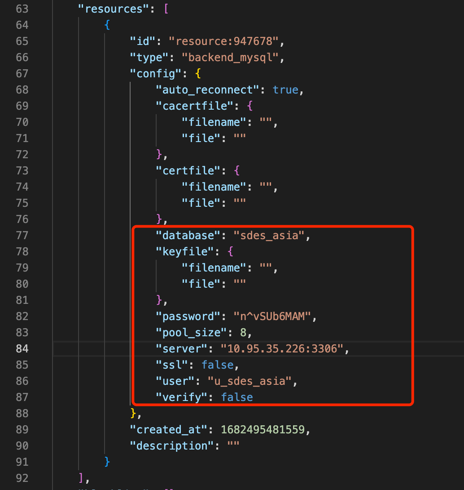

Then the module needs to modify the relevant configuration information of the Watsons module and the Prometheus monitoring module. The Prometheus monitoring module needs to modify the url address to the new pushgateway address, which is located on line 123.

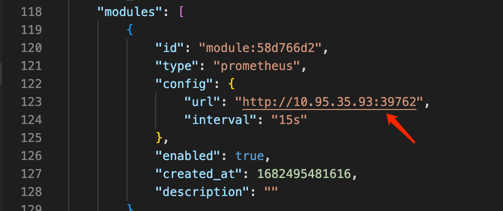

The Watsons module also needs to be modified to the corresponding actual MySQL-related configuration, which is located in lines 170-173.

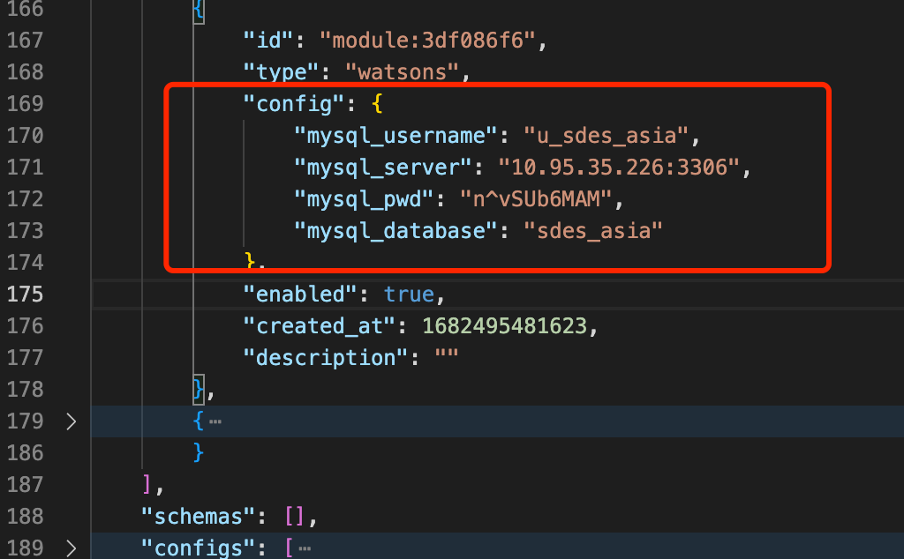

Save all modifications, and then return to the EMQX Dashboard page to import and upload json to restore the configuration.

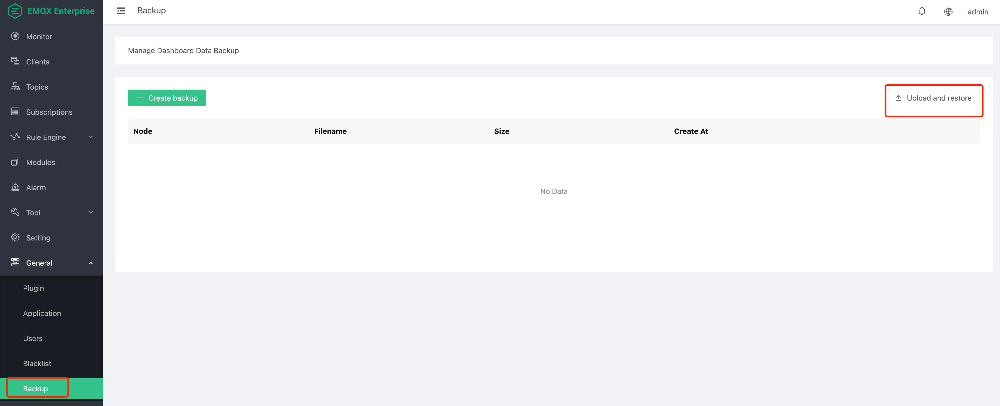

### Manual configuration

#### Module

##### Watsons Server

Find `Modules` in the left navigation bar, click to enter and click `Add Module`.

Click on `Local Modules` to find `Watsons Server`. Or enter `Watsons Server` in the search bar on the right

Click `Select` to enter the module configuration.

Here you need to fill in the corresponding MySQL database address and other information according to the actual situation.

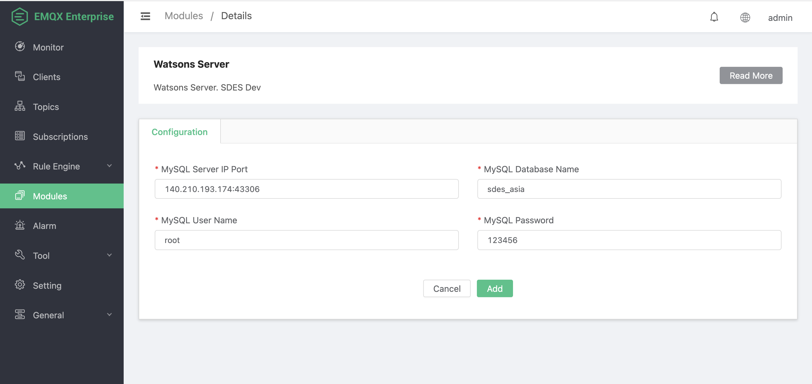

configuration parameters

| Name | Type | Info |
| -------------------- | ------ | --------------------- --------------- |
| MySQL Server IP Port | String | MySQL database address and service port number |
| MySQL Database Name | String | MySQL database name |
| MySQL User Name | String | MySQL database login user, must have read and write permissions |
| MySQL Password | String | MySQL database login password |

Click the `Add` button, and the plug-in will load data from the MySQL database when it starts, and also initialize some business query processes. According to the MySQL performance and network speed, the startup will be slow, generally taking 4 to 5 seconds.

#### The module started successfully

##### Prometheus

Click `Devops` to find `EMQX Prometheus Agent`. Or enter `EMQX Prometheus Agent` in the search bar on the right and click `Select` to enter the module configuration.

Here you need to fill in the corresponding Pushgateway information according to the actual situation.

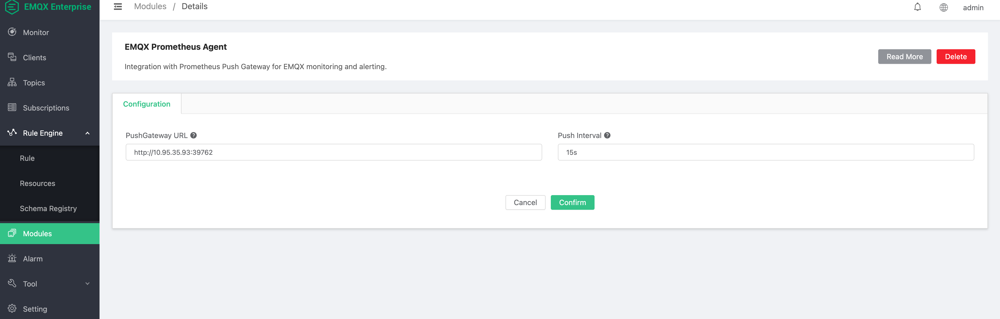

configuration parameters

| Name | Type | Info |
| --------------- | ------ | -------------------- |
| PushGateway URL | String | PushGateway URL address |
| Push Interval | String | push interval |

##### The module started successfully

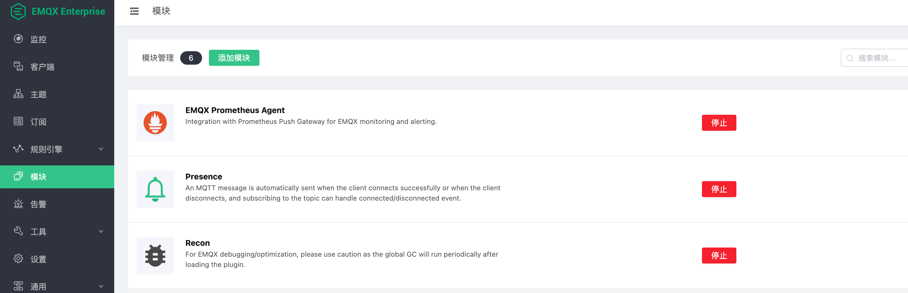

### Module Considerations

The module only needs to be started once, and the startup process will be automatically synchronized in the cluster.

#### Rule

After the module configuration is completed, a rule needs to be configured through the EMQX rule engine. This rule is mainly used for Job log report. First you need to configure MySQL resources.

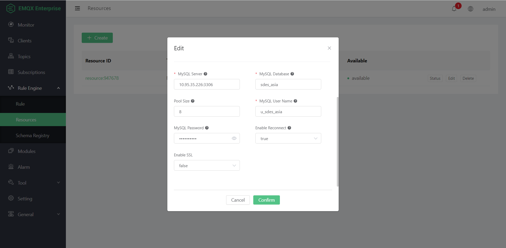

Fill in the main MySQL-related information, and then click Add Rule.

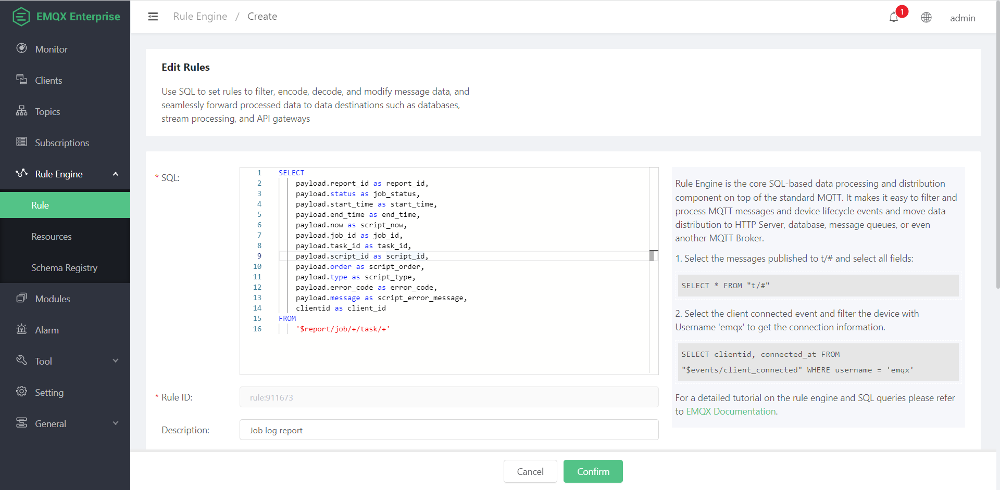

The SQL content of the rule is as follows.

~~~sql
SELECT
     payload.report_id as report_id,
     payload.status as job_status,
     payload.start_time as start_time,
     payload.end_time as end_time,
     payload.now as script_now,
     payload.job_id as job_id,
     payload.task_id as task_id,
     payload.script_id as script_id,
     payload.order as script_order,
     payload.type as script_type,
     payload.error_code as error_code,
     payload.message as script_error_message,
     clientid as client_id
FROM
     '$report/job/+/task/+'
~~~

Then the action that needs to configure the rules will output the relevant data to the MySQL database after processing.

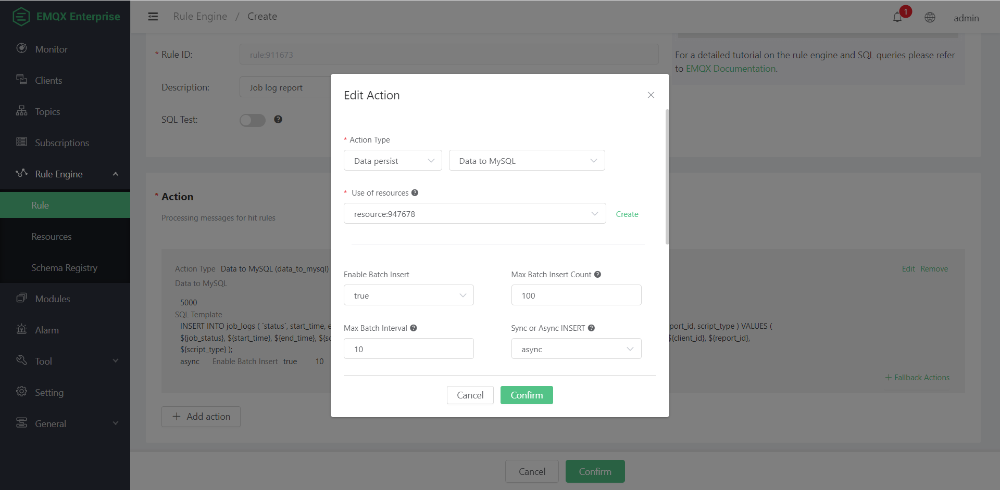

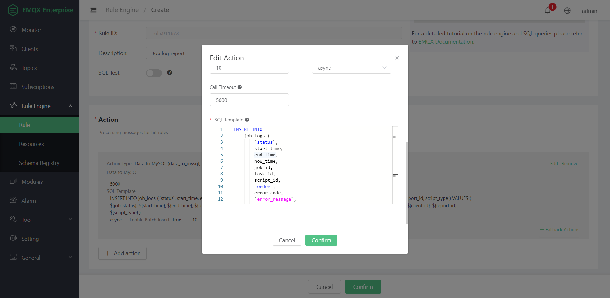

Fill in the insert statement in the SQL Template content, the content is as follows

~~~sql

INSERT INTO
     job_logs (
         `status`,
         start_time,
         end_time,
         now_time,
         job_id,
         task_id,
         script_id,
         `order`,
         error_code,
         `error_message`,
         mqtt_client_id,
         report_id,
         script_type
     )
VALUES
(
     ${job_status},
     ${start_time},
     ${end_time},
     ${script_now},
     ${job_id},
     ${task_id},
     ${script_id},
     ${script_order},
     ${error_code},
     ${script_error_message},
     ${client_id},
     ${report_id},
     ${script_type}
     );
~~~

After all configurations are complete, click confirm to submit.

### deploy backend-api

Open the daocloud platform, click on the application and choose to arrange the application through YAML. The steps here are the same as above.

~~~yaml
kind: Deployment
apiVersion: apps/v1
metadata:
  name: emqx-backend-api
  namespace: emqx-ee
  labels:
    app.kubernetes.io/name: emqx-backend-api
spec:
  replicas: 1
  selector:
    matchLabels:
      app.kubernetes.io/name: emqx-backend-api
  template:
    metadata:
      name: emqx-backend-api
      labels:
        app.kubernetes.io/name: emqx-backend-api
    spec:
      volumes:
        - name: backend-api-configmap
          configMap:
            name: emqx-backend-api
            items:
              - key: application.yml
                path: application.yml
            defaultMode: 420
      containers:
        - name: emqx-backend-api
          image: "10.95.35.98/emqx/emqx-backend-api:202305101513"
          imagePullPolicy: IfNotPresent
          ports:
            - name: backend-api
              containerPort: 9000
              protocol: TCP
          resources:
            limits: {}
          volumeMounts:
            - name: backend-api-configmap
              mountPath: /config/application.yml
              subPath: application.yml
              readOnly: false

---
kind: Service
apiVersion: v1
metadata:
  name: emqx-backend-api
  namespace: emqx-ee

  labels:
    app.kubernetes.io/name: emqx-backend-api

spec:
  ports:
    - name: backend-api
      protocol: TCP
      port: 9000
      targetPort: backend-api
  selector:
    app.kubernetes.io/name: emqx-backend-api

  type: NodePort

---
kind: ConfigMap
apiVersion: v1
metadata:
  name: emqx-backend-api
  namespace: emqx-ee

  labels:
    app.kubernetes.io/name: emqx-backend-api
data:
  application.yml: |-
    spring:
      application:
        name: sdes-api
    ---
    spring:
      datasource:
        url: jdbc:mysql://10.95.35.226:3306/sdes_asia?useUnicode=true&characterEncoding=utf-8
        username: u_sdes_asia
        password: n^vSUb6MAM
        type: com.alibaba.druid.pool.DruidDataSource
        driver-class-name: com.mysql.cj.jdbc.Driver
      mvc:
        view:
          prefix: classpath:/templates/
          suffix: .html
      thymeleaf:
        cache: false
      devtools:
        restart:
          enabled: true
          exclude: static/**,templates/**
        livereload:
          enabled: true
        remote:
          debug:
            enabled: true
      http:
        encoding:
          charset: UTF-8
          enabled: true
          force: true
      output:
        ansi:
          enabled: always
    mybatis:
      mapper-locations: classpath*:mapper/**/*.xml
      type-aliases-package: cn.xiaohuodui.model
    server:
      port: 9000
    logging:
      level:
        root: info
    sdes:
      baseUrl: http://10.95.35.93:33816
      token: Basic YWRtaW46ZW1xeGEzMDMu
~~~
Note that here you need to modify `namespace: emqx-ee` to the corresponding k8S namespace, and the image name and image tag need to be modified to `image: "10.95.35.98/emqx/emqx-backend-api:202305101513"` of the corresponding private warehouse. Modify jdbc-related configuration information and sdes-related configuration information in `confingmap`.
~~~yml
datasource:
  url: jdbc:mysql://10.95.35.226:3306/sdes_asia?useUnicode=true&characterEncoding=utf-8
  username: u_sdes_asia
  password: n^vSUb6MAM
~~~

The configuration here needs to be changed to the corresponding MySQL address, user name, password and other information that are the same as those on EMQX.

At the same time, you need to modify the relevant information of the sdes configuration item.

~~~yml
sdes:
  baseUrl: http://10.95.35.93:33816
  token: Basic YWRtaW46ZW1xeGEzMDMu
~~~

Here, the baseUrl address is the EMQX Dashboard address, and token is its authentication information. If the password needs to be changed, it needs to be modified.