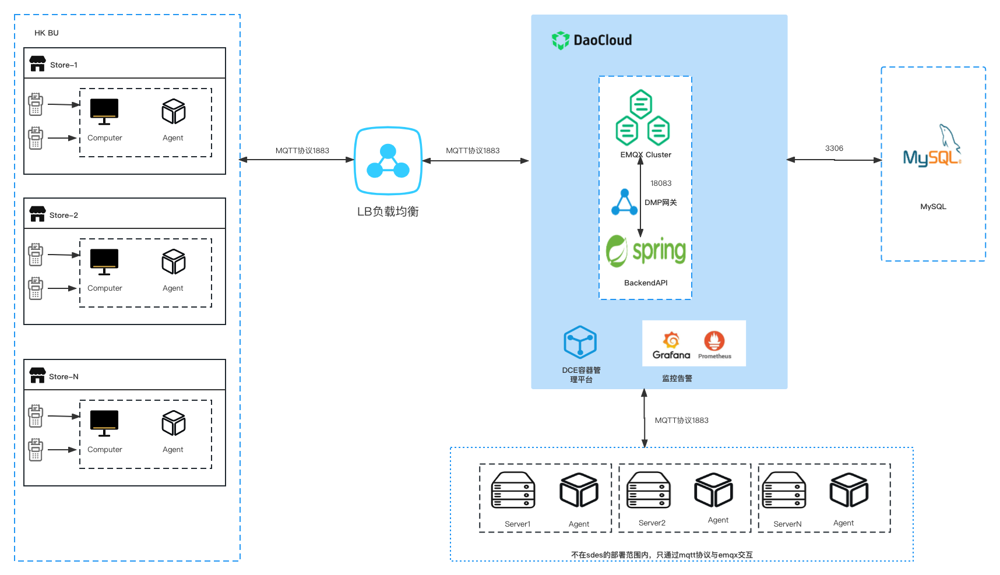

# EMQX & Watsons SDES Deploy

## Architecture Design

### EMQX Enterprise Watsons SDES customized version

Based on EMQX Enterprise Edition, custom-developed plug-ins include the following functions

- Authentication: store startup authentication (issue store information, authentication information based on IP address), connection management and authentication management after the device BOOT process
- Authentication: business process authentication, file transfer based on SDES Job management, authorization of both ends (server and store) during file transfer
- File transfer protocol: file fragmentation, integrity check, file broadcast, partition push
- Protocol control: business management, flow control, device information delivery, file transfer service delivery
- Device management plug-in: store message channel management, instant notification of online and offline

For the opening and starting of the module, please refer to the `Watsons Module` chapter.

The EMQX Enterprise version uses a three-node cluster to ensure high service availability.

### EMQX Backend API

Microservices written using the Java SpringBoot framework, RESTFul API. Serves the SDES front-end console. For detailed API interface documentation, refer to the `API docs` chapter.

### MySQL database

Provide data support for the SDES platform. For database table design, refer to `MySQL DataBase` chapter.

### Front-end interactive component SDES Dashboard

#### Function (3 sections: access, message distribution, data cache)

#### Rule engine use (just write MySQL resource configuration, log report persistence rules. Online and offline events have been transferred to the internal implementation of the plug-in)

## Architecture Diagram

