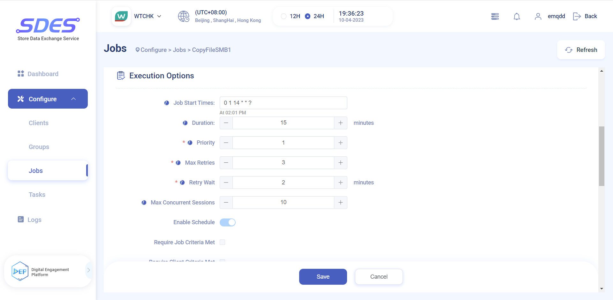
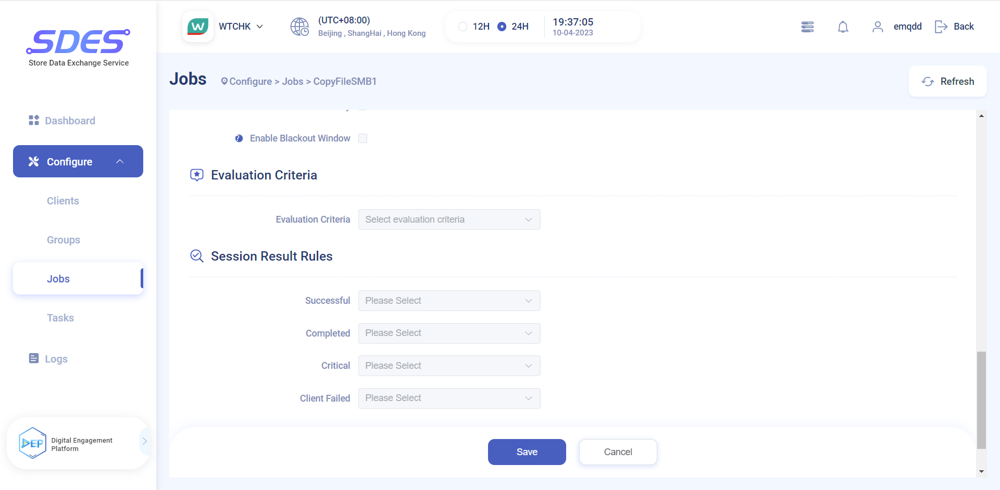
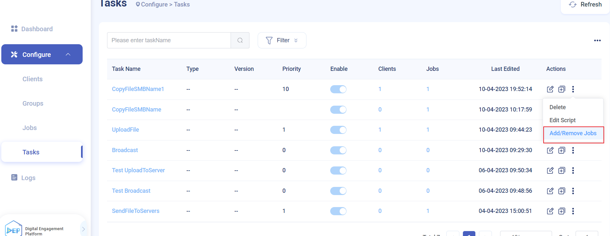

# EMQX & Watsons SDES Jobs

## Job - Task - Script relationship
## How to create a Job
Click Add Job on SDES Dashboard

Then you need to configure some key information such as `Job Start Times` `Priority` `Max Retries` `Retry Wait` and so on.

## How to set the execution time of the Job

### Introduction to crontab
crontab is a tool for automatically executing commands or scripts on Linux and Unix-like operating systems. It allows users to schedule tasks to run on a pre-defined schedule such as daily, weekly or monthly. The crontab command is used to create, edit, and delete these scheduled tasks.
The time format is as follows:
~~~shell
f1 f2 f3 f4 f5 ?
~~~
- Where f1 is the minute, f2 is the hour, f3 is the day of the month, f4 is the month, and f5 is the day of the week.
- When f1 is *, it means to execute every minute, when f2 is *, it means to execute the program every hour, and so on.
- When f1 is a-b, it means that it will be executed from minute a to minute b, when f2 is a-b, it will be executed from hour a to b, and so on.
- When f1 is */n, it means to execute once every n minutes, when f2 is */n, it means to execute every n hours, and so on.
- When f1 is a, b, c,..., it means that the a, b, c,... minute will be executed; when f2 is a, b, c,..., it means the a, b, c.. . hours to be executed, and the rest by analogy.
~~~shell
*    *    *    *    *
-    -    -    -    -
|    |    |    |    |
|    |    |    |    +----- Day of the week (0 - 6) (0 for Sunday)
|    |    |    +---------- Month (1 - 12) 
|    |    +--------------- Day of the month (1 - 31)
|    +-------------------- Hour (0 - 23)
+------------------------- Minute (0 - 59)
~~~
Below are some common crontabs.
|Execution Time                | Example      |
| --------------------- | --------- |
| Scheduled execution every hour       | 0 * * * * |
| Execute once a day         | 0 0 * * * |
| Execute once a week         | 0 0 * * 0 |
| Executed once a month         | 0 0 1 * * |
| Execute regularly on the last day of each month | 0 0 L * * |
| Executed once a year         | 0 0 1 1 * |       
## How Job binds Task & Clients
After the Task is successfully added, you can choose to add a Job

After configuring the Job, add and configure the Task. After the Task is added successfully, select Add Job and select the created Job just now.

