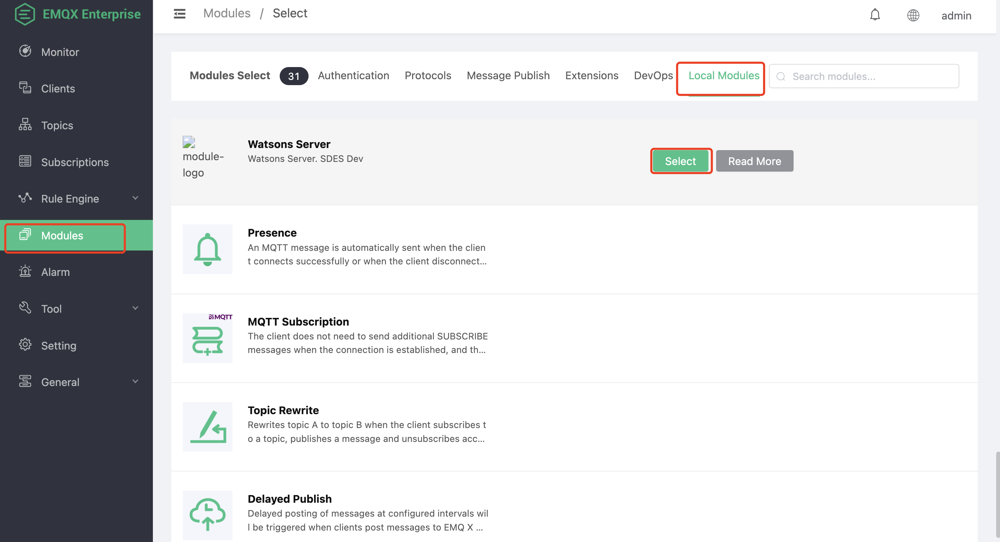
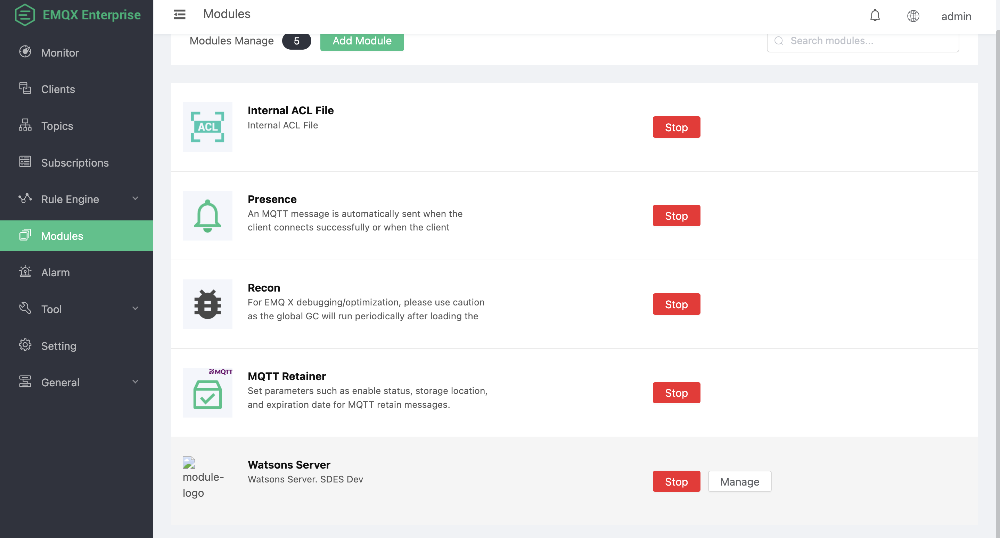

# Watsons Module

## Open EMQX Dashboard

Note: Open the Dashboard of EMQX, not the Dashboard of SDES.

The default port is `18083`. If there is port mapping or load balancing, please consult the operation and maintenance deployment personnel.

### Log in to EMQX background management Dashboard

default account

```text
admin
```

default password

```text
public
```

After EMQX version 4.4, the default account password will be changed for the first time, and the changed password cannot be obtained again. Please keep the new password properly.

### Module

Find `Modules` in the left navigation bar, click to enter and click `Add Module`.


Click on `Local Modules` to find `Watsons Server`. Or enter `Watsons Server` in the search bar on the right



Click `Select` to enter the module configuration.


configuration parameters

| Name | Type | Info |
| - | - | - |
| MySQL Server IP Port | String | MySQL database address and service port number |
| MySQL Database Name | String | MySQL database name |
| MySQL User Name | String | MySQL database login user, must have read and write permissions |
| MySQL Password | String | MySQL database login password |

Click the `Add` button, and the plug-in will load data from the MySQL database when it starts, and also initialize some business query processes. According to the MySQL performance and network speed, the startup will be slow, generally taking 4 to 5 seconds.

### The module started successfully



### Module Considerations

The module only needs to be started once, and the startup process will be automatically synchronized in the cluster.

### Configure Persistence

Method 1 (not recommended):

Mount the EMQX persistent directory, the directory location is

```path
emqx/data/
```

This method is applicable in the scenario where the server IP does not change. When the IP changes, it may cause EMQX cluster failure and data recovery failure

Method 2 (recommended):

By backing up data, refer to `Data import and export` (`Data import and export`) chapter for details