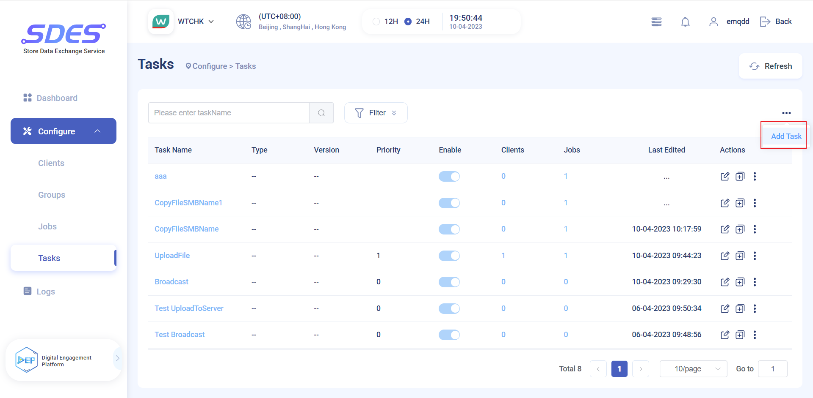
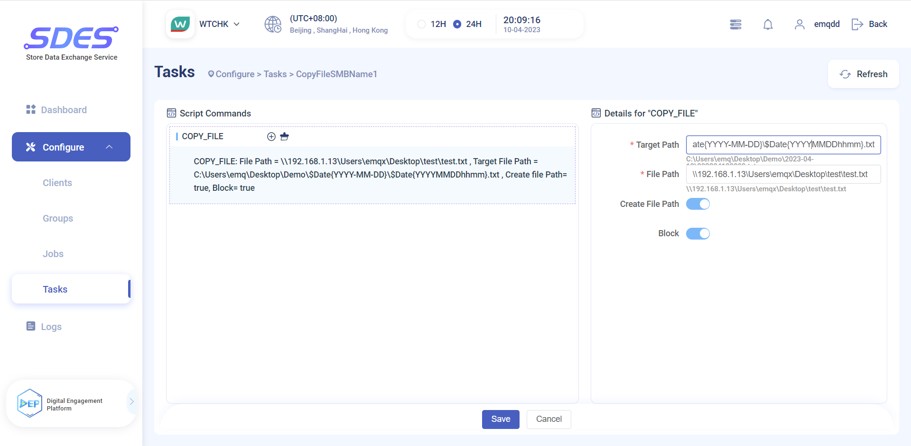

# EMQX & Watsons SDES Tasks

## Information meaning of Task

## Add new task
Click Add Task on SDES Dashboard

## Add Script to Task
Select the appropriate Task and click Edit Script.

Then you can configure information such as Target Path and File Path in the script.
