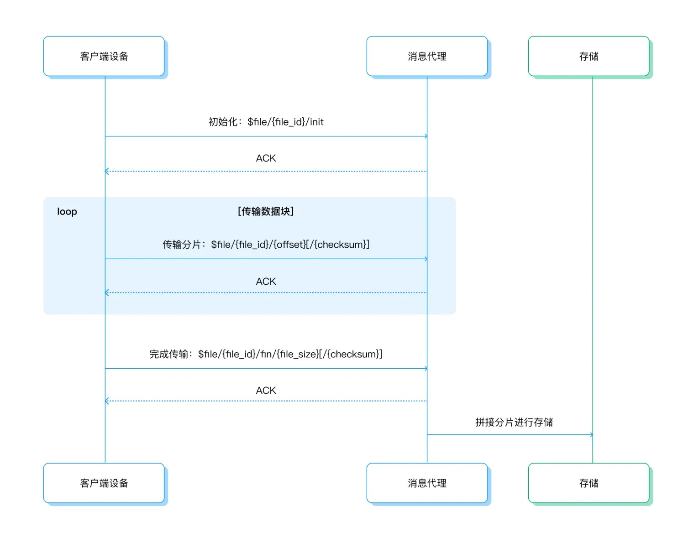

# 文件传输客户端开发

本页提供了从客户端角度对文件传输过程的概述，并提供了用于上传文件到 EMQX 的命令的详细信息，帮助您为客户端开发实现文件传输功能。

## 通用流程

从客户端侧进行文件传输的典型流程包括以下步骤：

1. 客户端设备选择要上传的文件并生成用于传输会话的唯一 `file_id`。
2. 客户端设备向 `$file/{file_id}/init` 主题发布 `init` 命令。消息的有效载荷包含文件的元数据，包括文件名、大小和校验和。
3. 客户端发送连续的 `segment` 命令到 `$file/{file_id}/{offset}[/{checksum}]` 主题。每个 `segment` 命令携带指定偏移量的文件数据块。`checksum` 字段是可选的，包含数据的校验和。
4. 客户端发送 `finish` 命令到 `$file/{file_id}/fin/{file_size}[/{checksum}]` 主题。此消息不使用有效载荷。`file_size` 参数表示文件的总大小，而 `checksum` 参数包含整个文件的校验和。



所有命令均以 QoS 1 消息等级发布，以确保可靠性。每个步骤的成功状态通过相应 MQTT PUBACK 消息的返回代码（RC）报告。如果发生错误，通常要求客户端重新启动整个文件传输过程。如果发生断开连接，客户端可以通过重新发送未确认的命令来恢复文件传输。

由于 EMQX 需要从接收到的文件片段中组装文件并将其导出到配置的存储中，`finish` 命令可能需要较长时间进行处理。在此期间，客户端可以在等待 `finish` 命令完成时继续发送其他命令。如果在 `finish` 命令期间发生断开连接，客户端可以简单地重新发送命令以恢复文件传输。如果文件传输已经完成， EMQX 将立即回复传输成功。

## 文件传输命令

文件传输命令是使用 QoS 1 发送到特定主题的常规 MQTT PUBLISH 消息。

### Init 命令

`init` 命令用于初始化文件传输会话。

主题：`$file/{file_id}/init`

有效载荷：一个带有以下字段的 JSON 对象：

```json
{
  "name": "{name}",
  "size": {size},
  "checksum": "{checksum}"
  "expire_at": {expire_at}
  "segments_ttl": {segments_ttl}
  "user_data": {user_data}
}
```

- `file_id`：文件传输会话的唯一标识符。
- `name`：文件名。如果与保留的文件名（例如“.”、“..”）冲突或包含像“/”、“”、“%”、“:”或不可打印的 Unicode 字符等字符，则将对其进行百分比编码以进行清理。文件名的二进制长度不应超过 240 字节。
- `size`：文件的大小（信息字段）。
- `checksum`：文件的 SHA256 校验和（可选）。如果提供， EMQX 将验证文件的校验和。
- `expire_at`：文件可能从存储中删除的时间戳（自纪元以来的秒数）。
- `segments_ttl`：文件片段的存活时间（以秒为单位）。此值被固定在`minimum_segments_ttl` 和 `maximum_segments_ttl` 参数设置指定的范围内。这两个参数在 EMQX 中进行配置，详见[文件片段设置](./broker.md#文件片段设置)。
- `user_data`：用于存储有关文件的其他信息及其元数据的任意 JSON 对象。

在有效载荷中，唯一必需的字段是 `name`。

示例：

```json
{
  "name": "ml-logs-data.log",
  "size": 12345,
  "checksum": "1234567890abcdef1234567890abcdef1234567890abcdef1234567890abcdef",
  "expire_at": 1696659943,
  "segments_ttl": 600
}
```

### Segment 命令

`segment` 命令用于上传文件的一个数据块。

主题：`$file/{file_id}/{offset}[/{checksum}]`

有效载荷：文件块的二进制数据。

- `file_id`：文件传输会话的唯一标识符。
- `offset`：文件块应写入的起始偏移量（以字节为单位），从文件的开头计算。

### Finish 命令

`finish` 命令用于完成文件传输会话。

主题：`$file/{file_id}/fin/{file_size}[/{checksum}]`

有效载荷：未使用。

- `file_id`：文件传输会话的唯一标识符。
- `file_size`：文件的总大小（以字节为单位）。
- `checksum`：整个文件的 SHA256 校验和。如果指定此值，它将优先于 `init` 命令中提供的 `checksum` 字段。

在接收到 `finish` 命令后，EMQX 将验证是否已接收到组装文件所需的所有片段。如果文件成功导出并且其校验和有效，EMQX 将以成功的返回代码（RC）进行响应。如果有任何错误，则发送适当的错误响应。

## 客户端代码示例

以下是不同语言和客户端库的文件传输客户端代码示例：

- [C - Paho](https://github.com/emqx/MQTT-Client-Examples/blob/master/mqtt-client-C-paho/emqx_file_transfer.c)
- [Python3 - Paho](https://github.com/emqx/MQTT-Client-Examples/blob/master/mqtt-client-Python3/file_transfer.py)
- [Java - Paho](https://github.com/emqx/MQTT-Client-Examples/blob/master/mqtt-client-Java/src/main/java/io/emqx/mqtt/MqttFileTransferSample.java)
- [Golang - Paho](https://github.com/emqx/MQTT-Client-Examples/pull/110/files#diff-ea542153b4dd7109626626beff78b699ed649f9a7c05af362e5d67cce0866a94)
- [Node.js - MQTT.js](https://github.com/emqx/MQTT-Client-Examples/blob/master/mqtt-client-Node.js/emqx-file-transfer.js)
