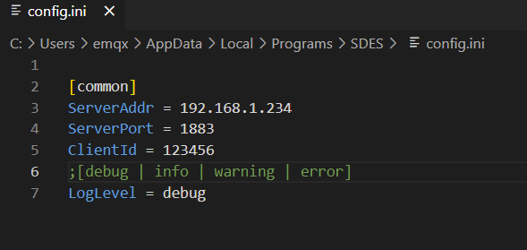

# EMQX & Watsons: SDES Agent Install

## Step 1 下载

## Step 2 安装
双击打开 `sdes_client.exe` 文件,然后点击 Install 进行安装。

## Step 3 配置

`强调：不要用win记事本编辑，要用专业的编辑器，notepad++、vscode等`。 
配置文件路径为`C:\Users\${USERS}\AppData\Local\Programs\SDES\config.ini`。这里${USERS}代表的是当前计算机用户名，比如我当前计算机的用户名为emqx。

这里 ServerAddr 为 EMQX Broker 的 IP 地址，ServerPort 为 MQTT 服务端口需要将其配置成对应的。