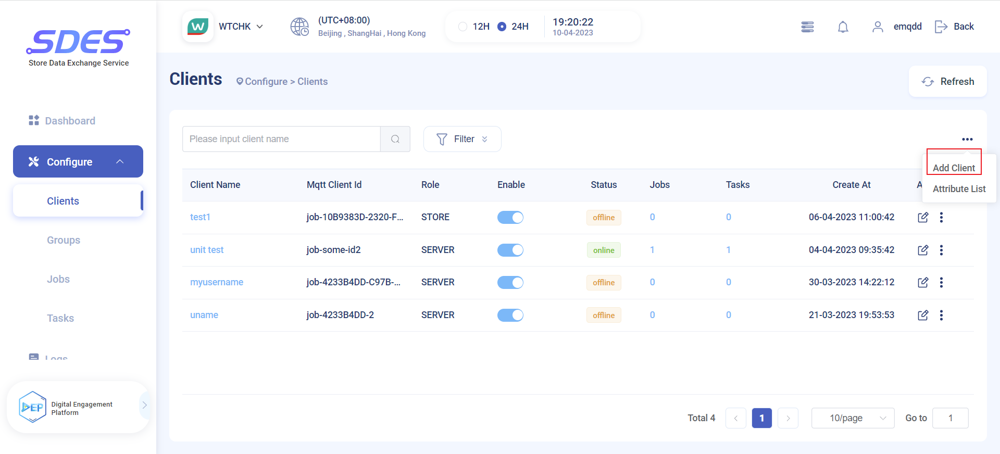

# EMQX & Watsons SDES Boot Client

## Step 1: 查询店铺的IP

## Step 2: 在前端配置信息，设置为 store/server
在 SDES Dashboard 点击添加客户端

配置客户端信息，设置角色为Store。

添加成功后，可以在页面上看到新添加的客户端。

## Step 3：添加 attributes & groups

## Step 4：安装，等待设备自动完成 boot 激活

## Step 5: 如何看到设备状态
在客户端列表界面可以看到设备的状态以及角色在线状态等相关信息。

## Step 6: 禁用设备
如果需要禁用某个设备，可以点击 Enable 列的按钮把其关闭即可实现禁用设备。