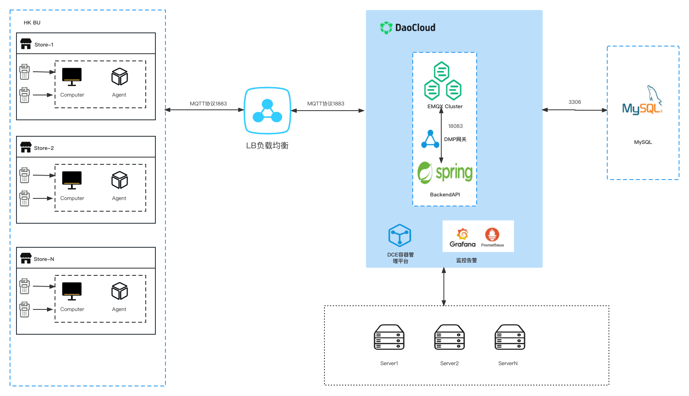

# EMQX & Watsons SDES Deploy

## 架构设计

### 组件 - EMQX EE 集群

#### 功能（3小节：接入、消息分发、数据缓存）

#### 配置（模块）

#### 规则引擎使用（只要写MySQL资源配置、日志上报持久化规则。上下线事件已经转移至插件内部实现）

### 组件 - BackendAPI （与MySQL交互、为前端提供接口）

### 组件 - MySQL 数据库（简介表结构）

## 架构图

