# EMQX & Watsons SDES Deploy

## 架构设计

### EMQX Enterprise Watsons SDES 定制版本

基于 EMQX 企业版，定制开发插件，包含以下功能

- 认证：门店启动认证（基于 IP 地址颁发门店信息、认证信息），设备 BOOT 流程之后的连接管理和认证管理
- 鉴权：业务流程认证，文件传输基于 SDES Job 管理，对文件传输过程中的双端（服务器与门店）授权
- 文件传输协议：文件分片，完整性校验、文件广播、分区推送
- 协议控制：业务管理、流量控制、设备信息下发、文件传输业务下发
- 设备管理插件：门店消息通道管理，上下线即时通知

模块的开启与启动请参考 `Watsons Module` 章节。

EMQX Enterprise 版本使用三节点集群的方式，确保服务高可用。

### EMQX Backend API

使用 Java SpringBoot 框架编写的微服务，RESTFul API 。为 SDES 前端控制台提供服务。详细的 API 接口文档参考 `API docs` 章节。

### MySQL 数据库

为 SDES 平台提供数据支撑。数据库表设计参考 `MySQL DataBase` 章节。

### 前端交互组件 SDES Dashboard

#### 功能（3小节：接入、消息分发、数据缓存）

#### 规则引擎使用（只要写MySQL资源配置、日志上报持久化规则。上下线事件已经转移至插件内部实现）

## 架构图

## 资源信息

资源配置以及端口信息如下

|     服务     |            资源配置             | 最小资源 |                          端口                           |
| :----------: | :-----------------------------: | :------: | :-----------------------------------------------------: |
| EMQX Cluster |           3 * (8c16g)           |   1c1g   | 1883 8883 8083 8084 8081 18083  |
|  BackendAPI  | API(Java SpringBoot)2 * (8c16g) | 0.5c500m |                          9000                           |
|    MySQL     |           1 * (8c16g)           |   1c1g   |                          3306                           |
|   Frontent   |           2 * (1c2g)            | 0.5c500m |                                                         |

## 开始部署

### 部署emqx-ee

打开daocloud平台，点击应用然后选择通过 YAML 编排应用。填写类型如下 YAML 文件。

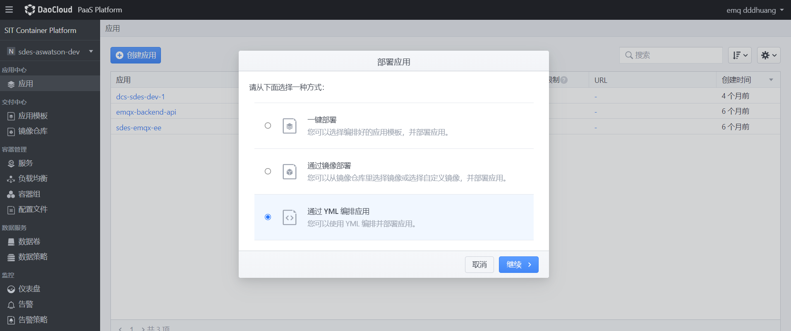

配置填写应用名称，填写如下 YAML 文件。

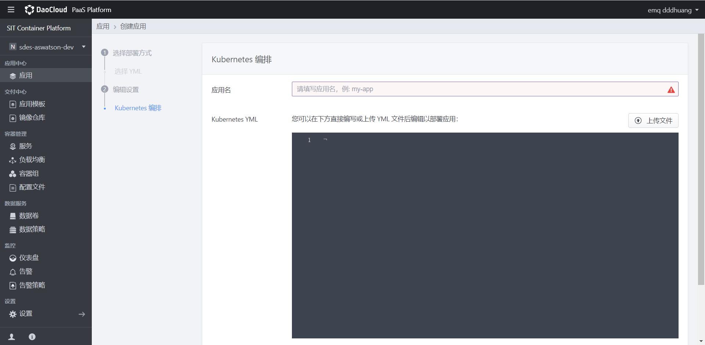

组建 EMQX 集群 yaml 文件内容如下：

~~~yaml
---
# create ns emqx
apiVersion: v1
kind: Namespace
metadata:
  labels:
    kubernetes.io/metadata.name: emqx-ee
  name: emqx-ee
---
# Source: rbac.yaml
apiVersion: v1
kind: ServiceAccount
metadata:
  namespace: emqx-ee
  name: emqx-ee

---
# rbac.yaml
kind: Role
apiVersion: rbac.authorization.k8s.io/v1
metadata:
  namespace: emqx-ee
  name: emqx-ee
rules:
- apiGroups:
  - ""
  resources:
  - endpoints 
  verbs: 
  - get
  - watch
  - list
---
# rbac.yaml
kind: RoleBinding
apiVersion: rbac.authorization.k8s.io/v1
metadata:
  namespace: emqx-ee
  name: emqx-ee
subjects:
  - kind: ServiceAccount
    name: emqx-ee
    namespace: emqx-ee
roleRef:
  kind: Role
  name: emqx-ee
  apiGroup: rbac.authorization.k8s.io  

---
# Source: configmap.yaml
apiVersion: v1
kind: ConfigMap
metadata:
  name: emqx-ee-env
  namespace: emqx-ee
  labels:
    app.kubernetes.io/name: emqx-ee
     
data:
    EMQX_CLUSTER__K8S__ADDRESS_TYPE: "hostname"
    EMQX_CLUSTER__K8S__APISERVER: "https://kubernetes.default.svc:443"
    EMQX_CLUSTER__K8S__SUFFIX: "svc.cluster.local"
    EMQX_LOG__TO: "both"
    EMQX_LOG__LEVEL: "error"
    EMQX_dashboard__default_user__login: "admin"
    EMQX_dashboard__default_user__password: "J#i2&Dbfc!od"
   
---
# service.yaml
apiVersion: v1
kind: Service
metadata:
  name: emqx-ee
  namespace: emqx-ee
  labels:
    app.kubernetes.io/name: emqx-ee
       
spec:
  type: NodePort
  ports:
  - name: mqtt
    port: 1883
    protocol: TCP
    targetPort: mqtt
  - name: mqttssl
    port: 8883
    protocol: TCP
    targetPort: mqttssl
  - name: mgmt
    port: 8081
    protocol: TCP
    targetPort: mgmt
  - name: ws
    port: 8083
    protocol: TCP
    targetPort: ws
  - name: wss
    port: 8084
    protocol: TCP
    targetPort: wss
  - name: dashboard
    port: 18083
    protocol: TCP
    targetPort: dashboard
  selector:
    app.kubernetes.io/name: emqx-ee
    
---
# service.yaml
apiVersion: v1
kind: Service
metadata:
  name: emqx-ee-headless
  namespace: emqx-ee
  labels:
    app.kubernetes.io/name: emqx-ee
       
spec:
  type: ClusterIP
  publishNotReadyAddresses: true
  sessionAffinity: None
  clusterIP: None
  ports:
  - name: mqtt
    port: 1883
    protocol: TCP
    targetPort: mqtt
  - name: mqttssl
    port: 8883
    protocol: TCP
    targetPort: mqttssl
  - name: mgmt
    port: 8081
    protocol: TCP
    targetPort: mgmt
  - name: ws
    port: 8083
    protocol: TCP
    targetPort: ws
  - name: wss
    port: 8084
    protocol: TCP
    targetPort: wss
  - name: dashboard
    port: 18083
    protocol: TCP
    targetPort: dashboard
  - name: ekka
    port: 4370
    protocol: TCP
    targetPort: ekka
  selector:
    app.kubernetes.io/name: emqx-ee
    
---
# StatefulSet.yaml
apiVersion: apps/v1
kind: StatefulSet
metadata:
  name: emqx-ee
  namespace: emqx-ee
  labels:
    app.kubernetes.io/name: emqx-ee
        
spec:
  serviceName: emqx-ee-headless
  podManagementPolicy: Parallel 
  
  updateStrategy:
    type: RollingUpdate 
  
  replicas: 3
  selector:
    matchLabels:
      app.kubernetes.io/name: emqx-ee
      
  template:
    metadata:
      labels:
        app: emqx-ee
        version: Watsons
        app.kubernetes.io/name: emqx-ee
        
    spec:
      volumes:
     
      - name: host-time
        hostPath: 
          path: /etc/localtime
      serviceAccountName:  emqx-ee
      
      containers:
        - name: emqx
          image: "10.95.35.98/emqx/emqx-ee:202304261421"
          imagePullPolicy: IfNotPresent
          
         
          ports:
          - name: mqtt
            containerPort: 1883
          - name: mqttssl
            containerPort: 8883
          - name: mgmt
            containerPort: 8081
          - name: ws
            containerPort: 8083
          - name: wss
            containerPort: 8084
          - name: dashboard
            containerPort: 18083
          - name: ekka
            containerPort: 4370
          envFrom:
            - configMapRef:
                name: emqx-ee-env
          env:
          - name: EMQX_NAME
            value: emqx
          - name: EMQX_CLUSTER__K8S__APP_NAME
            value: emqx
          - name: EMQX_CLUSTER__DISCOVERY
            value: k8s
          - name: EMQX_CLUSTER__K8S__SERVICE_NAME
            value: emqx-ee-headless
          - name: EMQX_CLUSTER__K8S__NAMESPACE
            value: emqx-ee
          resources: {}
          volumeMounts:
          - name: host-time
            mountPath: /etc/localtime
          
          readinessProbe:
            httpGet:
              path: /status
              port: 8081
            initialDelaySeconds: 10
            periodSeconds: 5
            failureThreshold: 30
            
          livenessProbe:
            httpGet:
              path: /status
              port: 8081
            initialDelaySeconds: 60
            periodSeconds: 30
            failureThreshold: 10  
~~~

注意这里需要把`namespace: emqx-ee`修改为对应的k8S命名空间，`EMQX_CLUSTER__K8S__NAMESPACE`对应的value也修改为对应的命名空间。镜像名镜像tag需要修改为相对应私有仓库的`image: "10.95.35.98/emqx/emqx-ee:202304261421"`。YAML 通过configmap的方式指定了EMQX Dashboard 用户的默认密码`J#i2&Dbfc!od`。

配置完成后通过Daocloud页面可以看到该应用对应的服务端口信息，可以看到对应关系如下。

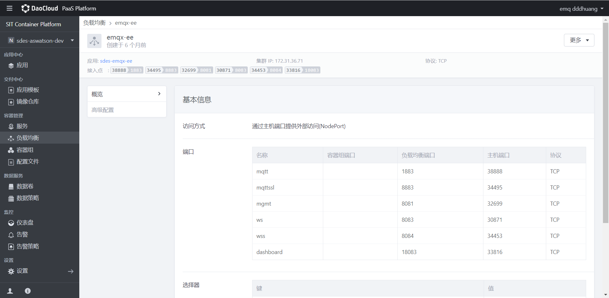

### 登陆 EMQX 后台管理 Dashboard

账号与密码,密码为上方设置的密码

~~~shell
admin/J#i2&Dbfc!od
~~~

### Module

在左侧导航栏找到 `Modules` ，点击进入后点击 `Add Module`。

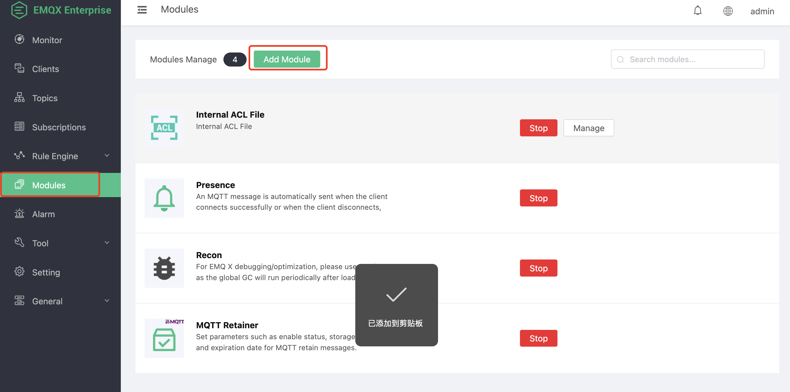

点击 `Local Modules` 找到 `Watsons Server`。或者在右侧搜索栏输入 `Watsons Server`

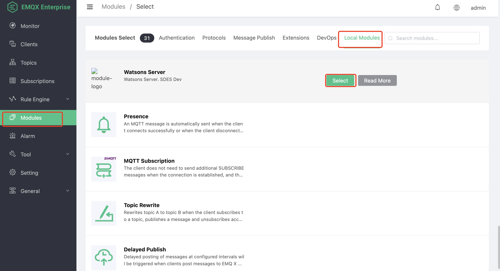

点击 `Select`，进入模块配置。

这里需要根据实际的情况填写对应的 MySQL 数据库地址等信息。

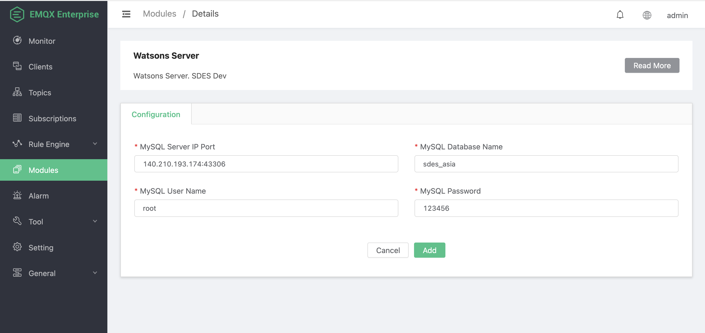

配置参数

| Name                 | Type   | Info                                 |
| -------------------- | ------ | ------------------------------------ |
| MySQL Server IP Port | String | MySQL 数据库地址与服务端口号         |
| MySQL Database Name  | String | MySQL 数据库名                       |
| MySQL User Name      | String | MySQL 数据库登陆用户，必须有读写权限 |
| MySQL Password       | String | MySQL 数据库登陆密码                 |

点击 `Add` 按钮，插件启动时会从 MySQL 数据库中加载数据，并且也会初始化一些业务查询过程，根据 MySQL 性能以及网络速度，启动会较慢，一般需要 4 到 5 秒。

### 模块启动成功

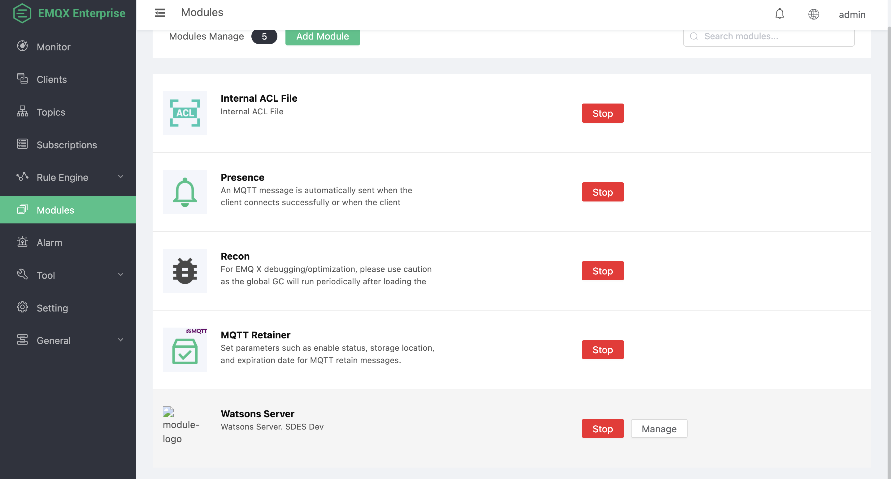

### 模块注意事项

模块仅需启动一次，启动过程会在集群中自动同步。

### Rule

模块配置完成后需要通过 EMQX 规则引擎配置一条规则，这个规则作用主要用来 Job log report。首先需要配置MySQL资源。

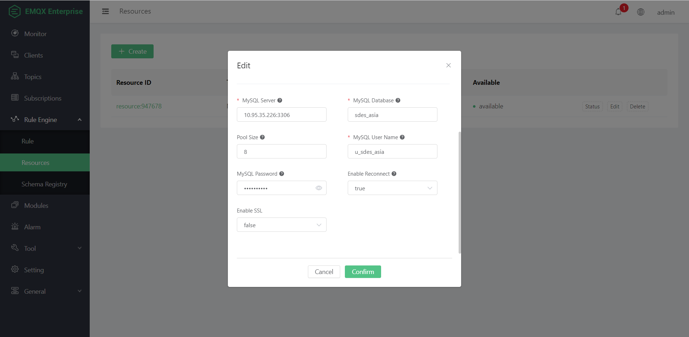

填写上主要的MySQL相关信息，然后点击添加规则。

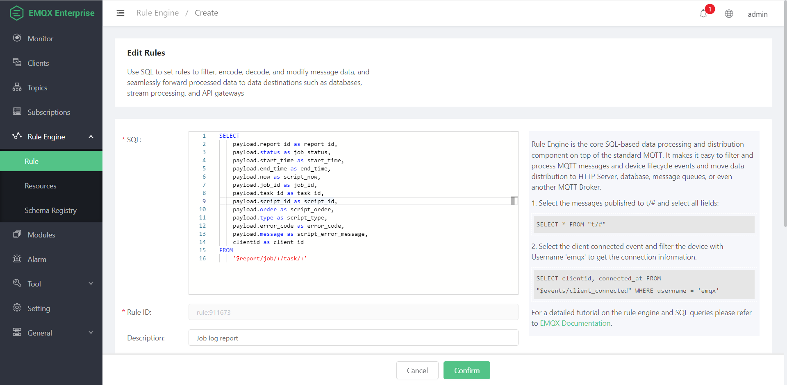

规则的 SQL 内容如下。

~~~sql
SELECT
    payload.report_id as report_id,
    payload.status as job_status,
    payload.start_time as start_time,
    payload.end_time as end_time,
    payload.now as script_now,
    payload.job_id as job_id,
    payload.task_id as task_id,
    payload.script_id as script_id,
    payload.order as script_order,
    payload.type as script_type,
    payload.error_code as error_code,
    payload.message as script_error_message,
    clientid as client_id
FROM
    '$report/job/+/task/+'
~~~

然后需要配置规则的 action 把相关数据处理后输出到 MySQL 数据库中。

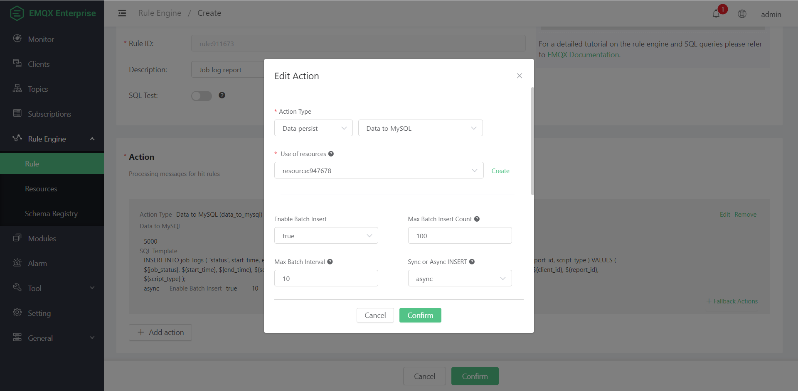

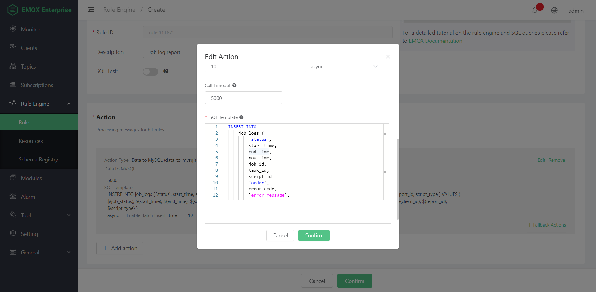

SQL Template 内容填上插入语句，内容如下

~~~sql

INSERT INTO
    job_logs (
        `status`,
        start_time,
        end_time,
        now_time,
        job_id,
        task_id,
        script_id,
        `order`,
        error_code,
        `error_message`,
        mqtt_client_id,
        report_id,
        script_type
    )
VALUES
(
    ${job_status},
    ${start_time},
    ${end_time},
    ${script_now},
    ${job_id},
    ${task_id},
    ${script_id},
    ${script_order},
    ${error_code},
    ${script_error_message},
    ${client_id},
    ${report_id},
    ${script_type}
    );
~~~

所有配置完成后点击 confirm 提交。

### 部署backend—api

打开daocloud平台，点击应用然后选择通过 YAML 编排应用。这里步骤跟上面一致

~~~yaml
kind: Deployment
apiVersion: apps/v1
metadata:
  name: emqx-backend-api
  namespace: emqx-ee
  labels:
    app.kubernetes.io/name: emqx-backend-api
spec:
  replicas: 1
  selector:
    matchLabels:
      app.kubernetes.io/name: emqx-backend-api
  template:
    metadata:
      name: emqx-backend-api
      labels:
        app.kubernetes.io/name: emqx-backend-api
    spec:
      volumes:
        - name: backend-api-configmap
          configMap:
            name: emqx-backend-api
            items:
              - key: application.yml
                path: application.yml
            defaultMode: 420
      containers:
        - name: emqx-backend-api
          image: "10.95.35.98/emqx/sdes-api:202305101513"
          imagePullPolicy: IfNotPresent
          ports:
            - name: backend-api
              containerPort: 9000
              protocol: TCP
          resources:
            limits: {}
          volumeMounts:
            - name: backend-api-configmap
              mountPath: /config/application.yml
              subPath: application.yml
              readOnly: false

---
kind: Service
apiVersion: v1
metadata:
  name: emqx-backend-api
  namespace: emqx-ee

  labels:
    app.kubernetes.io/name: emqx-backend-api

spec:
  ports:
    - name: backend-api
      protocol: TCP
      port: 9000
      targetPort: backend-api
  selector:
    app.kubernetes.io/name: emqx-backend-api

  type: NodePort

---
kind: ConfigMap
apiVersion: v1
metadata:
  name: emqx-backend-api
  namespace: emqx-ee

  labels:
    app.kubernetes.io/name: emqx-backend-api
data:
  application.yml: |-
    spring:
      application:
        name: sdes-api
    ---
    spring:
      datasource:
        url: jdbc:mysql://10.95.35.226:3306/sdes_asia?useUnicode=true&characterEncoding=utf-8
        username: u_sdes_asia
        password: n^vSUb6MAM
        type: com.alibaba.druid.pool.DruidDataSource
        driver-class-name: com.mysql.cj.jdbc.Driver
      mvc:
        view:
          prefix: classpath:/templates/
          suffix: .html
      thymeleaf:
        cache: false
      devtools:
        restart:
          enabled: true
          exclude: static/**,templates/**
        livereload:
          enabled: true
        remote:
          debug:
            enabled: true
      http:
        encoding:
          charset: UTF-8
          enabled: true
          force: true
      output:
        ansi:
          enabled: always
    mybatis:
      mapper-locations: classpath*:mapper/**/*.xml
      type-aliases-package: cn.xiaohuodui.model
    server:
      port: 9000
    logging:
      level:
        root: info
    sdes:
      baseUrl: http://10.95.35.93:33816
      token: Basic YWRtaW46SiNpMiZEYmZjIW9k
~~~

注意这里需要把`namespace: emqx-ee`修改为对应的k8S命名空间，镜像名镜像tag需要修改为相对应私有仓库的`image: "10.95.35.98/emqx/sdes-api:202305101513"`，需要修改`confingmap`中jdbc相关配置信息以及sdes相关配置信息。

~~~yml
datasource:
	url: jdbc:mysql://10.95.35.226:3306/sdes_asia?useUnicode=true&characterEncoding=utf-8
	username: u_sdes_asia
	password: n^vSUb6MAM
~~~

这里配置需要改成跟 EMQX 那边一样的相对应的 MySQL 地址、用户名、密码等信息。

同时需要修改一下 sdes 配置项相关信息。

~~~yml
sdes:
  baseUrl: http://10.95.35.93:33816
  token: Basic YWRtaW46YWRtaW4=
~~~

这里 baseUrl 地址为 EMQX Dashboard 地址，token为其认证信息如果有修改密码需要对其进行修改。