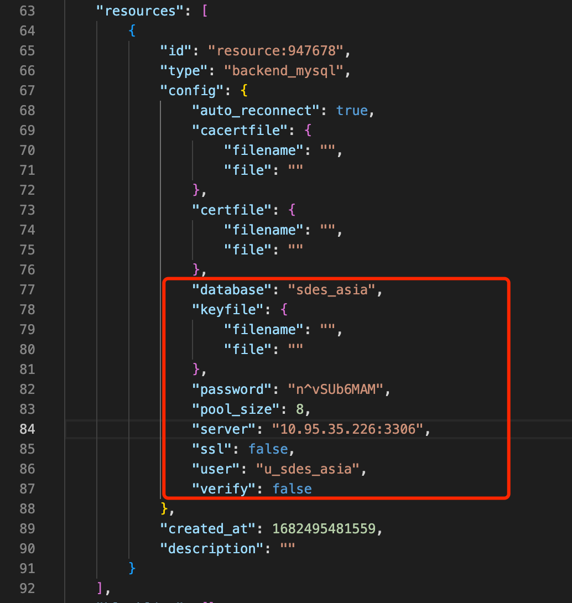
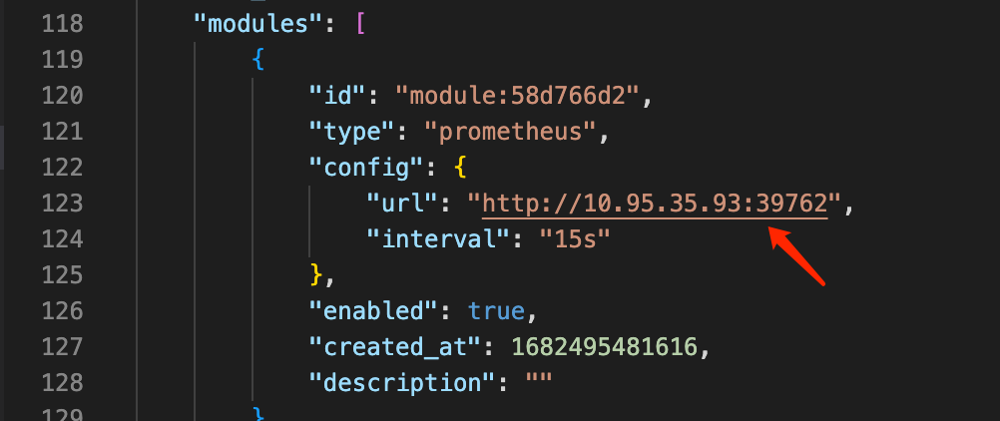
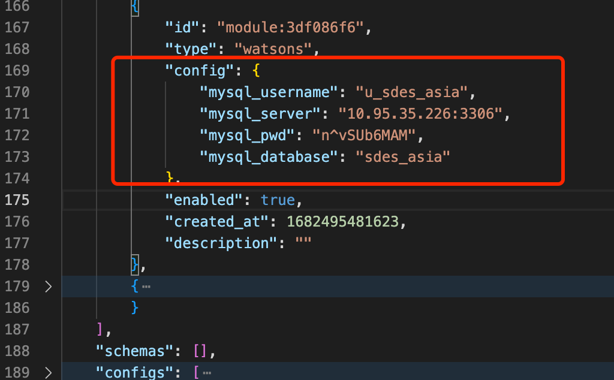
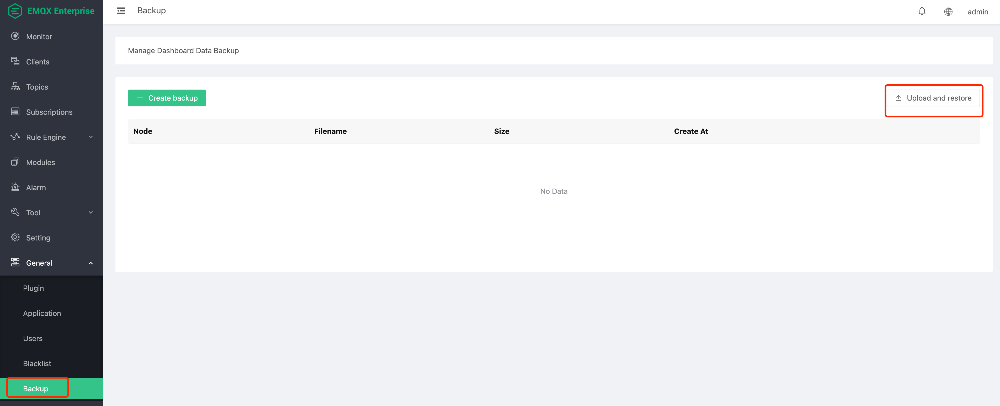
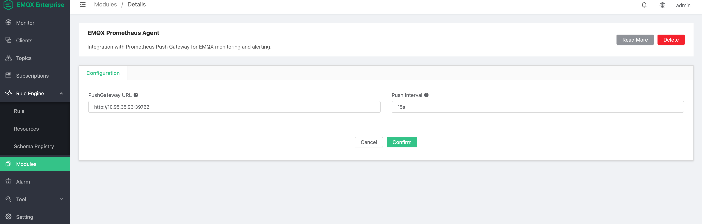
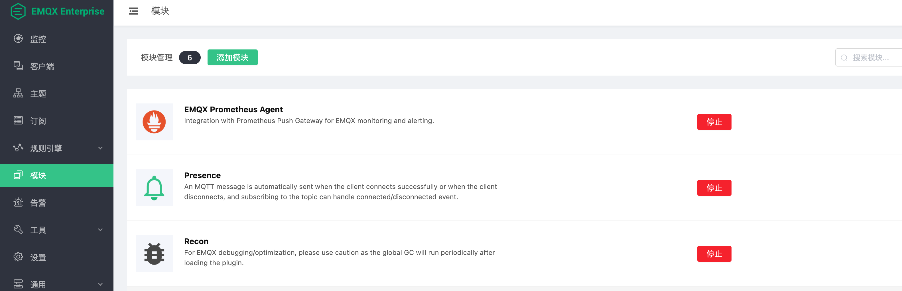

# EMQX & Watsons SDES Deploy

## 架构设计

### EMQX Enterprise Watsons SDES 定制版本

基于 EMQX 企业版，定制开发插件，包含以下功能

- 认证：门店启动认证（基于 IP 地址颁发门店信息、认证信息），设备 BOOT 流程之后的连接管理和认证管理
- 鉴权：业务流程认证，文件传输基于 SDES Job 管理，对文件传输过程中的双端（服务器与门店）授权
- 文件传输协议：文件分片，完整性校验、文件广播、分区推送
- 协议控制：业务管理、流量控制、设备信息下发、文件传输业务下发
- 设备管理插件：门店消息通道管理，上下线即时通知

模块的开启与启动请参考 `Watsons Module` 章节。

EMQX Enterprise 版本使用三节点集群的方式，确保服务高可用。

### EMQX Backend API

使用 Java SpringBoot 框架编写的微服务，RESTFul API 。为 SDES 前端控制台提供服务。详细的 API 接口文档参考 `API docs` 章节。

### MySQL 数据库

为 SDES 平台提供数据支撑。数据库表设计参考 `MySQL DataBase` 章节。

### 前端交互组件 SDES Dashboard

#### 功能（3小节：接入、消息分发、数据缓存）

#### 规则引擎使用（只要写MySQL资源配置、日志上报持久化规则。上下线事件已经转移至插件内部实现）

## 架构图

## 资源信息

资源配置以及端口信息如下

|     服务     |            资源配置             | 最小资源 |                          端口                           |
| :----------: | :-----------------------------: | :------: | :-----------------------------------------------------: |
| EMQX Cluster |           3 * (8c16g)           |   1c1g   | 1883 8883 8083 8084 8081 18083  |
|  BackendAPI  | API(Java SpringBoot)2 * (8c16g) | 0.5c500m |                          9000                           |
|    MySQL     |           1 * (8c16g)           |   1c1g   |                          3306                           |
|   Frontent   |           2 * (1c2g)            | 0.5c500m |                                                         |

## 开始部署

### 部署emqx-ee

打开daocloud平台，点击应用然后选择通过 YAML 编排应用。填写类型如下 YAML 文件。

配置填写应用名称，填写如下 YAML 文件。

组建 EMQX 集群 yaml 文件内容如下：

~~~yaml
---
# create ns emqx
apiVersion: v1
kind: Namespace
metadata:
  labels:
    kubernetes.io/metadata.name: emqx-ee
  name: emqx-ee
---
# Source: rbac.yaml
apiVersion: v1
kind: ServiceAccount
metadata:
  namespace: emqx-ee
  name: emqx-ee

---
# rbac.yaml
kind: Role
apiVersion: rbac.authorization.k8s.io/v1
metadata:
  namespace: emqx-ee
  name: emqx-ee
rules:
- apiGroups:
  - ""
  resources:
  - endpoints 
  verbs: 
  - get
  - watch
  - list
---
# rbac.yaml
kind: RoleBinding
apiVersion: rbac.authorization.k8s.io/v1
metadata:
  namespace: emqx-ee
  name: emqx-ee
subjects:
  - kind: ServiceAccount
    name: emqx-ee
    namespace: emqx-ee
roleRef:
  kind: Role
  name: emqx-ee
  apiGroup: rbac.authorization.k8s.io  

---
# Source: configmap.yaml
apiVersion: v1
kind: ConfigMap
metadata:
  name: emqx-ee-env
  namespace: emqx-ee
  labels:
    app.kubernetes.io/name: emqx-ee
     
data:
    EMQX_CLUSTER__K8S__ADDRESS_TYPE: "hostname"
    EMQX_CLUSTER__K8S__APISERVER: "https://kubernetes.default.svc:443"
    EMQX_CLUSTER__K8S__SUFFIX: "svc.cluster.local"
    EMQX_LOG__TO: "both"
    EMQX_LOG__LEVEL: "error"
    EMQX_dashboard__default_user__login: "admin"
    EMQX_dashboard__default_user__password: "emqxa303."
   
---
# service.yaml
apiVersion: v1
kind: Service
metadata:
  name: emqx-ee
  namespace: emqx-ee
  labels:
    app.kubernetes.io/name: emqx-ee
       
spec:
  type: NodePort
  ports:
  - name: mqtt
    port: 1883
    protocol: TCP
    targetPort: mqtt
  - name: mqttssl
    port: 8883
    protocol: TCP
    targetPort: mqttssl
  - name: mgmt
    port: 8081
    protocol: TCP
    targetPort: mgmt
  - name: ws
    port: 8083
    protocol: TCP
    targetPort: ws
  - name: wss
    port: 8084
    protocol: TCP
    targetPort: wss
  - name: dashboard
    port: 18083
    protocol: TCP
    targetPort: dashboard
  selector:
    app.kubernetes.io/name: emqx-ee
    
---
# service.yaml
apiVersion: v1
kind: Service
metadata:
  name: emqx-ee-headless
  namespace: emqx-ee
  labels:
    app.kubernetes.io/name: emqx-ee
       
spec:
  type: ClusterIP
  publishNotReadyAddresses: true
  sessionAffinity: None
  clusterIP: None
  ports:
  - name: mqtt
    port: 1883
    protocol: TCP
    targetPort: mqtt
  - name: mqttssl
    port: 8883
    protocol: TCP
    targetPort: mqttssl
  - name: mgmt
    port: 8081
    protocol: TCP
    targetPort: mgmt
  - name: ws
    port: 8083
    protocol: TCP
    targetPort: ws
  - name: wss
    port: 8084
    protocol: TCP
    targetPort: wss
  - name: dashboard
    port: 18083
    protocol: TCP
    targetPort: dashboard
  - name: ekka
    port: 4370
    protocol: TCP
    targetPort: ekka
  selector:
    app.kubernetes.io/name: emqx-ee
    
---
# StatefulSet.yaml
apiVersion: apps/v1
kind: StatefulSet
metadata:
  name: emqx-ee
  namespace: emqx-ee
  labels:
    app.kubernetes.io/name: emqx-ee
        
spec:
  serviceName: emqx-ee-headless
  podManagementPolicy: Parallel 
  
  updateStrategy:
    type: RollingUpdate 
  
  replicas: 3
  selector:
    matchLabels:
      app.kubernetes.io/name: emqx-ee
      
  template:
    metadata:
      labels:
        app: emqx-ee
        version: Watsons
        app.kubernetes.io/name: emqx-ee
        
    spec:
      volumes:
     
      - name: host-time
        hostPath: 
          path: /etc/localtime
      serviceAccountName:  emqx-ee
      
      containers:
        - name: emqx
          image: "10.95.35.98/emqx/emqx-ee:202304261421"
          imagePullPolicy: IfNotPresent
          
         
          ports:
          - name: mqtt
            containerPort: 1883
          - name: mqttssl
            containerPort: 8883
          - name: mgmt
            containerPort: 8081
          - name: ws
            containerPort: 8083
          - name: wss
            containerPort: 8084
          - name: dashboard
            containerPort: 18083
          - name: ekka
            containerPort: 4370
          envFrom:
            - configMapRef:
                name: emqx-ee-env
          env:
          - name: EMQX_NAME
            value: emqx
          - name: EMQX_CLUSTER__K8S__APP_NAME
            value: emqx
          - name: EMQX_CLUSTER__DISCOVERY
            value: k8s
          - name: EMQX_CLUSTER__K8S__SERVICE_NAME
            value: emqx-ee-headless
          - name: EMQX_CLUSTER__K8S__NAMESPACE
            value: emqx-ee
          resources: {}
          volumeMounts:
          - name: host-time
            mountPath: /etc/localtime
          
          readinessProbe:
            httpGet:
              path: /status
              port: 8081
            initialDelaySeconds: 10
            periodSeconds: 5
            failureThreshold: 30
            
          livenessProbe:
            httpGet:
              path: /status
              port: 8081
            initialDelaySeconds: 60
            periodSeconds: 30
            failureThreshold: 10  
~~~

注意这里需要把`namespace: emqx-ee`修改为对应的k8S命名空间，`EMQX_CLUSTER__K8S__NAMESPACE`对应的value也修改为对应的命名空间。镜像名镜像tag需要修改为相对应私有仓库的`image: "10.95.35.98/emqx/emqx-ee:202304261421"`。YAML 通过configmap的方式指定了EMQX Dashboard 用户的默认密码`emqxa303.`。

配置完成后通过Daocloud页面可以看到该应用对应的服务端口信息，可以看到对应关系如下。

### 登陆 EMQX 后台管理 Dashboard

账号与密码,密码为上方设置的密码

~~~shell
admin/emqxa303.
~~~

### 恢复EMQX配置

主要有两种方法

1、通过修改备份json然后导入恢复(推荐)。

2、手动在dashboard页面进行配置。

### 导入json恢复

完整的json文件如下所示

~~~json
{
    "version": "4.4",
    "rules": [
        {
            "id": "rule:911673",
            "rawsql": "SELECT\n    payload.report_id as report_id,\n    payload.status as job_status,\n    payload.start_time as start_time,\n    payload.end_time as end_time,\n    payload.now as script_now,\n    payload.job_id as job_id,\n    payload.task_id as task_id,\n    payload.script_id as script_id,\n    payload.order as script_order,\n    payload.type as script_type,\n    payload.error_code as error_code,\n    payload.message as script_error_message,\n    clientid as client_id\nFROM\n    '$report/job/+/task/+'",
            "actions": [
                {
                    "id": "data_to_mysql_1678601756022978870",
                    "name": "data_to_mysql",
                    "fallbacks": [],
                    "args": {
                        "sync_timeout": 5000,
                        "sql": "INSERT INTO\n    job_logs (\n        `status`,\n        start_time,\n        end_time,\n        now_time,\n        job_id,\n        task_id,\n        script_id,\n        `order`,\n        error_code,\n        `error_message`,\n        mqtt_client_id,\n        report_id,\n        script_type\n    )\nVALUES\n(\n    ${job_status},\n    ${start_time},\n    ${end_time},\n    ${script_now},\n    ${job_id},\n    ${task_id},\n    ${script_id},\n    ${script_order},\n    ${error_code},\n    ${script_error_message},\n    ${client_id},\n    ${report_id},\n    ${script_type}\n    );",
                        "insert_mode": "async",
                        "enable_batch": true,
                        "batch_time": 10,
                        "batch_size": 100,
                        "$resource": "resource:947678"
                    }
                }
            ],
            "enabled": true,
            "description": "Job log report"
        },
        {
            "id": "rule:458783",
            "rawsql": "SELECT \nclientid, \nusername,\nformat_date('millisecond', 0, '%Y-%m-%d %H:%M:%S%:z',connected_at) as connected_at\nFROM \n\"$events/client_connected\"",
            "actions": [
                {
                    "id": "data_to_mysql_1678601787360224313",
                    "name": "data_to_mysql",
                    "fallbacks": [],
                    "args": {
                        "sql": "INSERT INTO \nclients(mqtt_client_id, user_name, status,connected_at) \nVALUES(${clientid}, ${username}, 'online', ${connected_at})\nON DUPLICATE KEY UPDATE status='online',connected_at=${connected_at};",
                        "enable_batch": false,
                        "$resource": "resource:947678"
                    }
                }
            ],
            "enabled": false,
            "description": "Online message"
        },
        {
            "id": "rule:199804",
            "rawsql": "SELECT \nclientid,\nformat_date('millisecond', 0, '%Y-%m-%d %H:%M:%S%:z',disconnected_at) as disconnected_at \nFROM \n\"$events/client_disconnected\"",
            "actions": [
                {
                    "id": "data_to_mysql_1678601804182431479",
                    "name": "data_to_mysql",
                    "fallbacks": [],
                    "args": {
                        "sql": "UPDATE clients\nSET status='offline', disconnected_at = ${disconnected_at}\nWHERE mqtt_client_id=${clientid};",
                        "enable_batch": false,
                        "$resource": "resource:947678"
                    }
                }
            ],
            "enabled": false,
            "description": "Offline message"
        }
    ],
    "resources": [
        {
            "id": "resource:947678",
            "type": "backend_mysql",
            "config": {
                "auto_reconnect": true,
                "cacertfile": {
                    "filename": "",
                    "file": ""
                },
                "certfile": {
                    "filename": "",
                    "file": ""
                },
                "database": "sdes_asia",
                "keyfile": {
                    "filename": "",
                    "file": ""
                },
                "password": "n^vSUb6MAM",
                "pool_size": 8,
                "server": "10.95.35.226:3306",
                "ssl": false,
                "user": "u_sdes_asia",
                "verify": false
            },
            "created_at": 1682495481559,
            "description": ""
        }
    ],
    "blacklist": [],
    "apps": [
        {
            "id": "admin",
            "secret": "public",
            "name": "Default",
            "desc": "Application user",
            "status": true,
            "expired": "undefined"
        }
    ],
    "users": [
        {
            "username": "admin",
            "password": "BAMiqEweLr7gmM+i9IZpnsOVTtE=",
            "tags": "administrator"
        },
        {
            "username": "ddd",
            "password": "TZR+FPpRCsqaEdqiJVP3itXEzHE=",
            "tags": ""
        }
    ],
    "auth_mnesia": [],
    "acl_mnesia": [],
    "modules": [
        {
            "id": "module:58d766d2",
            "type": "prometheus",
            "config": {
                "url": "http://10.95.35.93:39762",
                "interval": "15s"
            },
            "enabled": true,
            "created_at": 1682495481616,
            "description": ""
        },
        {
            "id": "module:4814a68c",
            "type": "internal_acl",
            "config": {
                "acl_rule_file": {
                    "filename": "acl.conf",
                    "file": "{allow, {user, \"dashboard\"}, subscribe, [\"$SYS/#\"]}.\n{allow, {ipaddr, \"127.0.0.1\"}, pubsub, [\"$SYS/#\", \"#\"]}.\n{deny, all, subscribe, [\"$SYS/#\", {eq, \"#\"}]}.\n{allow, all}.\n"
                }
            },
            "enabled": true,
            "created_at": 1673836325184,
            "description": ""
        },
        {
            "id": "module:22196f43",
            "type": "presence",
            "config": {
                "qos": 0
            },
            "enabled": true,
            "created_at": 1673836325184,
            "description": ""
        },
        {
            "id": "module:64091203",
            "type": "retainer",
            "config": {
                "storage_type": "ram",
                "max_retained_messages": 0,
                "max_payload_size": "1MB",
                "expiry_interval": 0
            },
            "enabled": true,
            "created_at": 1673836325184,
            "description": ""
        },
        {
            "id": "module:3df086f6",
            "type": "watsons",
            "config": {
                "mysql_username": "u_sdes_asia",
                "mysql_server": "10.95.35.226:3306",
                "mysql_pwd": "n^vSUb6MAM",
                "mysql_database": "sdes_asia"
            },
            "enabled": true,
            "created_at": 1682495481623,
            "description": ""
        },
        {
            "id": "module:58d274fb",
            "type": "recon",
            "config": {},
            "enabled": true,
            "created_at": 1673836325184,
            "description": ""
        }
    ],
    "schemas": [],
    "configs": [
        {
            "name": "license",
            "confs": {
                "connection_high_watermark_alarm": "80%",
                "connection_low_watermark_alarm": "75%"
            }
        },
        {
            "type": "tcp",
            "name": "internal",
            "confs": {
                "acceptors": "4",
                "active_n": "1000",
                "backlog": "512",
                "listener": "127.0.0.1:11883",
                "max_conn_rate": "1000",
                "max_connections": "1024000",
                "nodelay": "false",
                "peer_cert_as_clientid": "null",
                "peer_cert_as_username": "null",
                "proxy_protocol": "null",
                "proxy_protocol_timeout": "null",
                "recbuf": "64KB",
                "reuseaddr": "true",
                "send_timeout": "5s",
                "send_timeout_close": "on",
                "sndbuf": "64KB",
                "zone": "internal"
            }
        },
        {
            "type": "tcp",
            "name": "external",
            "confs": {
                "acceptors": "8",
                "active_n": "100",
                "backlog": "1024",
                "listener": "0.0.0.0:1883",
                "max_conn_rate": "1000",
                "max_connections": "1024000",
                "nodelay": "true",
                "peer_cert_as_clientid": "null",
                "peer_cert_as_username": "null",
                "proxy_protocol": "null",
                "proxy_protocol_timeout": "null",
                "recbuf": "null",
                "reuseaddr": "true",
                "send_timeout": "15s",
                "send_timeout_close": "on",
                "sndbuf": "null",
                "zone": "external"
            }
        },
        {
            "zone": "internal",
            "confs": {
                "allow_anonymous": "true",
                "exclusive_subscription": "null",
                "max_topic_alias": "null",
                "enable_stats": "on",
                "quota_overall_messages_routing": "null",
                "use_username_as_clientid": "null",
                "quota_conn_messages_routing": "null",
                "idle_timeout": "null",
                "latency_samples": "null",
                "acl_deny_action": "ignore",
                "publish_limit": "null",
                "mqueue_store_qos0": "true",
                "force_shutdown_policy": "null",
                "session_expiry_interval": "null",
                "bypass_auth_plugins": "true",
                "keepalive_backoff": "null",
                "enable_flapping_detect": "off",
                "upgrade_qos": "null",
                "conn_congestion_min_alarm_sustain_duration": "null",
                "mqueue_priorities": "null",
                "rate_limit_conn_messages_in": "null",
                "strict_mode": "false",
                "shared_subscription": "null",
                "server_keepalive": "null",
                "wildcard_subscription": "null",
                "max_clientid_len": "null",
                "response_information": "null",
                "mountpoint": "null",
                "max_awaiting_rel": "1000",
                "acl_nomatch": "null",
                "retry_interval": "null",
                "retain_available": "null",
                "ignore_loop_deliver": "false",
                "enable_acl": "off",
                "max_qos_allowed": "null",
                "rate_limit_conn_bytes_in": "null",
                "max_mqueue_len": "10000",
                "max_topic_levels": "null",
                "max_subscriptions": "0",
                "force_gc_policy": "null",
                "mqueue_default_priority": "null",
                "max_inflight": "128",
                "conn_congestion_alarm": "null",
                "enable_ban": "null",
                "await_rel_timeout": "null",
                "max_packet_size": "null"
            }
        },
        {
            "name": "emqx",
            "confs": {
                "acl_cache_max_size": "32",
                "acl_cache_ttl": "1m",
                "acl_deny_action": "ignore",
                "acl_nomatch": "allow",
                "acl_order": "none",
                "allow_anonymous": "true",
                "auth_order": "none",
                "broker_session_locking_strategy": "quorum",
                "broker_shared_dispatch_ack_enabled": "false",
                "broker_shared_subscription_strategy": "random",
                "broker_sys_heartbeat": "30s",
                "broker_sys_interval": "1m",
                "enable_acl_cache": "on",
                "flapping_detect_policy": "30, 1m, 5m",
                "mqtt_exclusive_subscription": "false",
                "mqtt_ignore_loop_deliver": "false",
                "mqtt_max_clientid_len": "65535",
                "mqtt_max_packet_size": "1MB",
                "mqtt_max_qos_allowed": "2",
                "mqtt_max_topic_alias": "65535",
                "mqtt_max_topic_levels": "128",
                "mqtt_retain_available": "true",
                "mqtt_shared_subscription": "true",
                "mqtt_strict_mode": "false",
                "mqtt_wildcard_subscription": "true"
            }
        },
        {
            "type": "wss",
            "name": "external",
            "confs": {
                "cacertfile": "null",
                "mqtt_piggyback": "multiple",
                "send_timeout_close": "on",
                "ciphers": "TLS_AES_256_GCM_SHA384,TLS_AES_128_GCM_SHA256,TLS_CHACHA20_POLY1305_SHA256,TLS_AES_128_CCM_SHA256,TLS_AES_128_CCM_8_SHA256,ECDHE-ECDSA-AES256-GCM-SHA384,ECDHE-RSA-AES256-GCM-SHA384,ECDHE-ECDSA-AES256-SHA384,ECDHE-RSA-AES256-SHA384,ECDHE-ECDSA-DES-CBC3-SHA,ECDH-ECDSA-AES256-GCM-SHA384,ECDH-RSA-AES256-GCM-SHA384,ECDH-ECDSA-AES256-SHA384,ECDH-RSA-AES256-SHA384,DHE-DSS-AES256-GCM-SHA384,DHE-DSS-AES256-SHA256,AES256-GCM-SHA384,AES256-SHA256,ECDHE-ECDSA-AES128-GCM-SHA256,ECDHE-RSA-AES128-GCM-SHA256,ECDHE-ECDSA-AES128-SHA256,ECDHE-RSA-AES128-SHA256,ECDH-ECDSA-AES128-GCM-SHA256,ECDH-RSA-AES128-GCM-SHA256,ECDH-ECDSA-AES128-SHA256,ECDH-RSA-AES128-SHA256,DHE-DSS-AES128-GCM-SHA256,DHE-DSS-AES128-SHA256,AES128-GCM-SHA256,AES128-SHA256,ECDHE-ECDSA-AES256-SHA,ECDHE-RSA-AES256-SHA,DHE-DSS-AES256-SHA,ECDH-ECDSA-AES256-SHA,ECDH-RSA-AES256-SHA,AES256-SHA,ECDHE-ECDSA-AES128-SHA,ECDHE-RSA-AES128-SHA,DHE-DSS-AES128-SHA,ECDH-ECDSA-AES128-SHA,ECDH-RSA-AES128-SHA,AES128-SHA",
                "idle_timeout": "null",
                "depth": "null",
                "sndbuf": "null",
                "proxy_protocol": "null",
                "recbuf": "null",
                "tls_versions": "null",
                "honor_cipher_order": "null",
                "check_origins": "https://localhost:8084, https://127.0.0.1:8084",
                "acceptors": "4",
                "max_connections": "102400",
                "proxy_address_header": "null",
                "zone": "external",
                "nodelay": "null",
                "fail_if_no_peer_cert": "null",
                "verify": "null",
                "mqtt_path": "/mqtt",
                "reuse_sessions": "null",
                "proxy_port_header": "null",
                "fail_if_no_subprotocol": "null",
                "proxy_protocol_timeout": "null",
                "check_origin_enable": "false",
                "allow_origin_absence": "true",
                "peer_cert_as_username": "null",
                "log_level": "null",
                "send_timeout": "15s",
                "supported_subprotocols": "null",
                "certfile": "etc/certs/cert.pem",
                "key_password": "null",
                "keyfile": "etc/certs/key.pem",
                "active_n": "100",
                "peer_cert_as_clientid": "null",
                "psk_ciphers": "null",
                "listener": "8084",
                "dhfile": "null",
                "backlog": "1024",
                "max_conn_rate": "1000",
                "secure_renegotiate": "null",
                "max_frame_size": "null"
            }
        },
        {
            "type": "ssl",
            "name": "external",
            "confs": {
                "cacertfile": "etc/certs/cacert.pem",
                "ocsp_responder_url": "null",
                "reuseaddr": "true",
                "send_timeout_close": "null",
                "ciphers": "TLS_AES_256_GCM_SHA384,TLS_AES_128_GCM_SHA256,TLS_CHACHA20_POLY1305_SHA256,TLS_AES_128_CCM_SHA256,TLS_AES_128_CCM_8_SHA256,ECDHE-ECDSA-AES256-GCM-SHA384,ECDHE-RSA-AES256-GCM-SHA384,ECDHE-ECDSA-AES256-SHA384,ECDHE-RSA-AES256-SHA384,ECDHE-ECDSA-DES-CBC3-SHA,ECDH-ECDSA-AES256-GCM-SHA384,ECDH-RSA-AES256-GCM-SHA384,ECDH-ECDSA-AES256-SHA384,ECDH-RSA-AES256-SHA384,DHE-DSS-AES256-GCM-SHA384,DHE-DSS-AES256-SHA256,AES256-GCM-SHA384,AES256-SHA256,ECDHE-ECDSA-AES128-GCM-SHA256,ECDHE-RSA-AES128-GCM-SHA256,ECDHE-ECDSA-AES128-SHA256,ECDHE-RSA-AES128-SHA256,ECDH-ECDSA-AES128-GCM-SHA256,ECDH-RSA-AES128-GCM-SHA256,ECDH-ECDSA-AES128-SHA256,ECDH-RSA-AES128-SHA256,DHE-DSS-AES128-GCM-SHA256,DHE-DSS-AES128-SHA256,AES128-GCM-SHA256,AES128-SHA256,ECDHE-ECDSA-AES256-SHA,ECDHE-RSA-AES256-SHA,DHE-DSS-AES256-SHA,ECDH-ECDSA-AES256-SHA,ECDH-RSA-AES256-SHA,AES256-SHA,ECDHE-ECDSA-AES128-SHA,ECDHE-RSA-AES128-SHA,DHE-DSS-AES128-SHA,ECDH-ECDSA-AES128-SHA,ECDH-RSA-AES128-SHA,AES128-SHA",
                "hibernate_after": "null",
                "depth": "null",
                "handshake_timeout": "15s",
                "sndbuf": "4KB",
                "proxy_protocol": "null",
                "gc_after_handshake": "null",
                "ocsp_issuer_pem": "null",
                "recbuf": "4KB",
                "tls_versions": "null",
                "honor_cipher_order": "null",
                "acceptors": "16",
                "enable_crl_check": "null",
                "max_connections": "102400",
                "zone": "external",
                "nodelay": "null",
                "fail_if_no_peer_cert": "null",
                "verify": "null",
                "reuse_sessions": "null",
                "proxy_protocol_timeout": "null",
                "ocsp_refresh_interval": "null",
                "peer_cert_as_username": "null",
                "log_level": "null",
                "send_timeout": "null",
                "certfile": "etc/certs/cert.pem",
                "key_password": "null",
                "keyfile": "etc/certs/key.pem",
                "active_n": "100",
                "peer_cert_as_clientid": "null",
                "psk_ciphers": "null",
                "crl_cache_urls": "null",
                "listener": "8883",
                "dhfile": "null",
                "backlog": "null",
                "max_conn_rate": "500",
                "secure_renegotiate": "null",
                "enable_ocsp_stapling": "null",
                "ocsp_refresh_http_timeout": "null"
            }
        },
        {
            "type": "ws",
            "name": "external",
            "confs": {
                "acceptors": "4",
                "active_n": "100",
                "allow_origin_absence": "true",
                "backlog": "1024",
                "check_origin_enable": "false",
                "check_origins": "http://localhost:18083, http://127.0.0.1:18083",
                "fail_if_no_subprotocol": "null",
                "idle_timeout": "null",
                "listener": "8083",
                "max_conn_rate": "1000",
                "max_connections": "102400",
                "max_frame_size": "null",
                "mqtt_path": "/mqtt",
                "mqtt_piggyback": "multiple",
                "nodelay": "true",
                "peer_cert_as_clientid": "null",
                "peer_cert_as_username": "null",
                "proxy_address_header": "null",
                "proxy_port_header": "null",
                "proxy_protocol": "null",
                "proxy_protocol_timeout": "null",
                "recbuf": "null",
                "send_timeout": "15s",
                "send_timeout_close": "on",
                "sndbuf": "null",
                "supported_subprotocols": "null",
                "zone": "external"
            }
        },
        {
            "name": "vm_mon",
            "confs": {
                "check_interval": "30s",
                "process_high_watermark": "80%",
                "process_low_watermark": "60%"
            }
        },
        {
            "zone": "external",
            "confs": {
                "allow_anonymous": "null",
                "exclusive_subscription": "null",
                "max_topic_alias": "null",
                "enable_stats": "on",
                "quota_overall_messages_routing": "null",
                "use_username_as_clientid": "false",
                "quota_conn_messages_routing": "null",
                "idle_timeout": "15s",
                "latency_samples": "null",
                "acl_deny_action": "ignore",
                "publish_limit": "null",
                "mqueue_store_qos0": "true",
                "force_shutdown_policy": "null",
                "session_expiry_interval": "2h",
                "bypass_auth_plugins": "null",
                "keepalive_backoff": "0.75",
                "enable_flapping_detect": "off",
                "upgrade_qos": "off",
                "conn_congestion_min_alarm_sustain_duration": "null",
                "mqueue_priorities": "none",
                "rate_limit_conn_messages_in": "null",
                "strict_mode": "false",
                "shared_subscription": "null",
                "server_keepalive": "null",
                "wildcard_subscription": "null",
                "max_clientid_len": "null",
                "response_information": "null",
                "mountpoint": "null",
                "max_awaiting_rel": "100",
                "acl_nomatch": "null",
                "retry_interval": "30s",
                "retain_available": "null",
                "ignore_loop_deliver": "false",
                "enable_acl": "on",
                "max_qos_allowed": "null",
                "rate_limit_conn_bytes_in": "null",
                "max_mqueue_len": "1000",
                "max_topic_levels": "null",
                "max_subscriptions": "0",
                "force_gc_policy": "16000|16MB",
                "mqueue_default_priority": "highest",
                "max_inflight": "32",
                "conn_congestion_alarm": "null",
                "enable_ban": "on",
                "await_rel_timeout": "300s",
                "max_packet_size": "null"
            }
        },
        {
            "name": "os_mon",
            "confs": {
                "cpu_check_interval": "60s",
                "cpu_high_watermark": "80%",
                "cpu_low_watermark": "60%",
                "mem_check_interval": "60s",
                "procmem_high_watermark": "5%",
                "sysmem_high_watermark": "70%"
            }
        }
    ],
    "listeners_state": [
        {
            "type": "tcp",
            "name": "internal",
            "status": true
        },
        {
            "type": "tcp",
            "name": "external",
            "status": true
        },
        {
            "type": "wss",
            "name": "external",
            "status": true
        },
        {
            "type": "ssl",
            "name": "external",
            "status": true
        },
        {
            "type": "ws",
            "name": "external",
            "status": true
        }
    ],
    "date": "2023-05-11 03:23:54"
}
~~~

注意需要修改json文件中的`resources`与`modules`相关信息。修改 MySQL 资源相关配置需要修改成相对应的位置在77-92行处。

然后模块需要修改一下 Watsons 模块以及 Prometheus 监控模块的相关配置信息，Prometheus 监控模块需要修改 url 地址为新的 pushgateway 地址，位置在123行。

Watsons 模块同样需要修改成相对应的实际 MySQL 相关配置，位置在170-173行。

所有修改完成后保存，然后再回到 EMQX Dashboard 页面进行导入上传 json 恢复配置。

### 手动配置

#### Module

##### Watsons Server

在左侧导航栏找到 `Modules` ，点击进入后点击 `Add Module`。

点击 `Local Modules` 找到 `Watsons Server`。或者在右侧搜索栏输入 `Watsons Server`

点击 `Select`，进入模块配置。

这里需要根据实际的情况填写对应的 MySQL 数据库地址等信息。

配置参数

| Name                 | Type   | Info                                 |
| -------------------- | ------ | ------------------------------------ |
| MySQL Server IP Port | String | MySQL 数据库地址与服务端口号         |
| MySQL Database Name  | String | MySQL 数据库名                       |
| MySQL User Name      | String | MySQL 数据库登陆用户，必须有读写权限 |
| MySQL Password       | String | MySQL 数据库登陆密码                 |

点击 `Add` 按钮，插件启动时会从 MySQL 数据库中加载数据，并且也会初始化一些业务查询过程，根据 MySQL 性能以及网络速度，启动会较慢，一般需要 4 到 5 秒。

##### 模块启动成功

##### Prometheus

点击 `Devops` 找到 `EMQX Prometheus Agent`。或者在右侧搜索栏输入 `EMQX Prometheus Agent`点击 `Select`，进入模块配置。

这里需要根据实际的情况填写对应的 Pushgateway 信息。

配置参数

| Name            | Type   | Info                 |
| --------------- | ------ | -------------------- |
| PushGateway URL | String | PushGateway URL 地址 |
| Push Interval   | String | 推送间隔             |

##### 模块启动成功

#### 模块注意事项

模块仅需启动一次，启动过程会在集群中自动同步。

#### Rule

模块配置完成后需要通过 EMQX 规则引擎配置一条规则，这个规则作用主要用来 Job log report。首先需要配置MySQL资源。

填写上主要的MySQL相关信息，然后点击添加规则。

规则的 SQL 内容如下。

~~~sql
SELECT
    payload.report_id as report_id,
    payload.status as job_status,
    payload.start_time as start_time,
    payload.end_time as end_time,
    payload.now as script_now,
    payload.job_id as job_id,
    payload.task_id as task_id,
    payload.script_id as script_id,
    payload.order as script_order,
    payload.type as script_type,
    payload.error_code as error_code,
    payload.message as script_error_message,
    clientid as client_id
FROM
    '$report/job/+/task/+'
~~~

然后需要配置规则的 action 把相关数据处理后输出到 MySQL 数据库中。

SQL Template 内容填上插入语句，内容如下

~~~sql

INSERT INTO
    job_logs (
        `status`,
        start_time,
        end_time,
        now_time,
        job_id,
        task_id,
        script_id,
        `order`,
        error_code,
        `error_message`,
        mqtt_client_id,
        report_id,
        script_type
    )
VALUES
(
    ${job_status},
    ${start_time},
    ${end_time},
    ${script_now},
    ${job_id},
    ${task_id},
    ${script_id},
    ${script_order},
    ${error_code},
    ${script_error_message},
    ${client_id},
    ${report_id},
    ${script_type}
    );
~~~

所有配置完成后点击 confirm 提交。

### 部署backend—api

打开daocloud平台，点击应用然后选择通过 YAML 编排应用。这里步骤跟上面一致

~~~yaml
kind: Deployment
apiVersion: apps/v1
metadata:
  name: emqx-backend-api
  namespace: emqx-ee
  labels:
    app.kubernetes.io/name: emqx-backend-api
spec:
  replicas: 1
  selector:
    matchLabels:
      app.kubernetes.io/name: emqx-backend-api
  template:
    metadata:
      name: emqx-backend-api
      labels:
        app.kubernetes.io/name: emqx-backend-api
    spec:
      volumes:
        - name: backend-api-configmap
          configMap:
            name: emqx-backend-api
            items:
              - key: application.yml
                path: application.yml
            defaultMode: 420
      containers:
        - name: emqx-backend-api
          image: "10.95.35.98/emqx/emqx-backend-api:202305101513"
          imagePullPolicy: IfNotPresent
          ports:
            - name: backend-api
              containerPort: 9000
              protocol: TCP
          resources:
            limits: {}
          volumeMounts:
            - name: backend-api-configmap
              mountPath: /config/application.yml
              subPath: application.yml
              readOnly: false

---
kind: Service
apiVersion: v1
metadata:
  name: emqx-backend-api
  namespace: emqx-ee

  labels:
    app.kubernetes.io/name: emqx-backend-api

spec:
  ports:
    - name: backend-api
      protocol: TCP
      port: 9000
      targetPort: backend-api
  selector:
    app.kubernetes.io/name: emqx-backend-api

  type: NodePort

---
kind: ConfigMap
apiVersion: v1
metadata:
  name: emqx-backend-api
  namespace: emqx-ee

  labels:
    app.kubernetes.io/name: emqx-backend-api
data:
  application.yml: |-
    spring:
      application:
        name: sdes-api
    ---
    spring:
      datasource:
        url: jdbc:mysql://10.95.35.226:3306/sdes_asia?useUnicode=true&characterEncoding=utf-8
        username: u_sdes_asia
        password: n^vSUb6MAM
        type: com.alibaba.druid.pool.DruidDataSource
        driver-class-name: com.mysql.cj.jdbc.Driver
      mvc:
        view:
          prefix: classpath:/templates/
          suffix: .html
      thymeleaf:
        cache: false
      devtools:
        restart:
          enabled: true
          exclude: static/**,templates/**
        livereload:
          enabled: true
        remote:
          debug:
            enabled: true
      http:
        encoding:
          charset: UTF-8
          enabled: true
          force: true
      output:
        ansi:
          enabled: always
    mybatis:
      mapper-locations: classpath*:mapper/**/*.xml
      type-aliases-package: cn.xiaohuodui.model
    server:
      port: 9000
    logging:
      level:
        root: info
    sdes:
      baseUrl: http://10.95.35.93:33816
      token: Basic YWRtaW46ZW1xeGEzMDMu
~~~

注意这里需要把`namespace: emqx-ee`修改为对应的k8S命名空间，镜像名镜像tag需要修改为相对应私有仓库的`image: "10.95.35.98/emqx/emqx-backend-api:202305101513"`，需要修改`confingmap`中jdbc相关配置信息以及sdes相关配置信息。

~~~yml
datasource:
	url: jdbc:mysql://10.95.35.226:3306/sdes_asia?useUnicode=true&characterEncoding=utf-8
	username: u_sdes_asia
	password: n^vSUb6MAM
~~~

这里配置需要改成跟 EMQX 那边一样的相对应的 MySQL 地址、用户名、密码等信息。

同时需要修改一下 sdes 配置项相关信息。

~~~yml
sdes:
  baseUrl: http://10.95.35.93:33816
  token: Basic YWRtaW46ZW1xeGEzMDMu
~~~

这里 baseUrl 地址为 EMQX Dashboard 地址，token为其认证信息如果有修改密码需要对其进行修改。