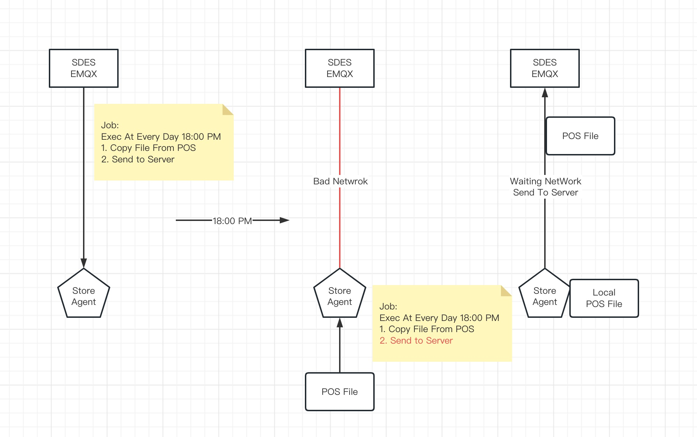
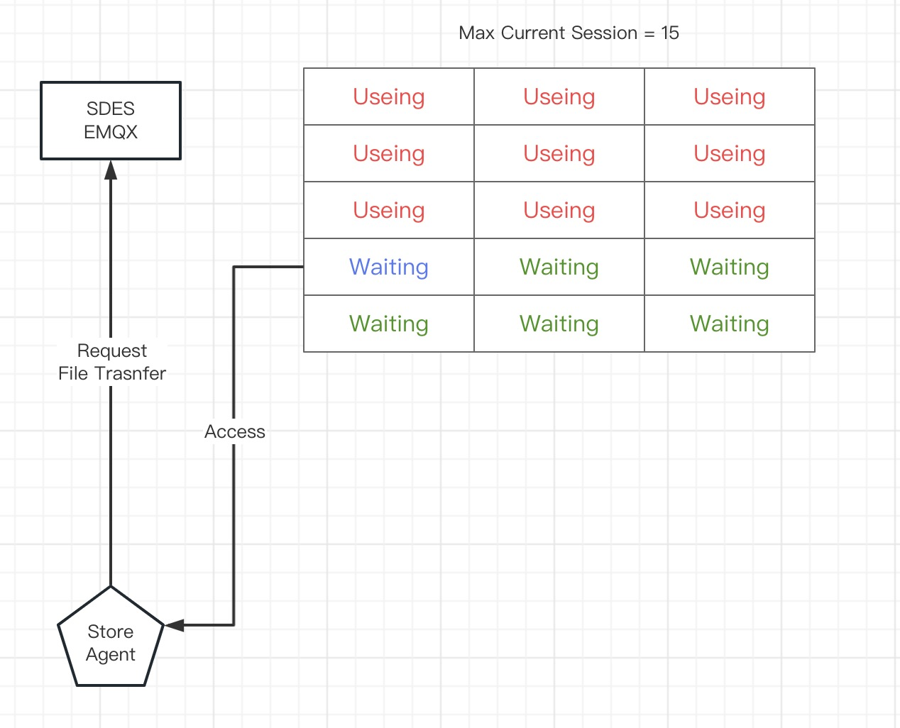

# Job 数据流

Job 作为 task 与 Agent 的绑定集合，并且有执行属性，属性列表如下

| Name | Type | Info |
| - | - | - |
| id | Integer | 唯一索引 |
| name | String | Job 名 |
| enable | Boolean | 是否启用 |
| execution_time | String(crontab) | 定时，使用 6 位 crontab 格式 |
| duration | Integer | 执行时长，超时控制 |
| max_current_session | Integer | 流量控制。仅对文件传输过程流控生效 |
| tasks | List(TaskID) | 关联的 Tasks |
| clients | List(ClientID) | 关联的 Agent Clients |

## 数据流设计

1. 创建 Tasks （创建操作参考 Task 文档）；
2. 创建 Job （创建操作参考 Job 文档）；
3. 关联 Tasks 与 Agent Clients；
4. SDES 将 Job 信息下发至 Agent；
5. Agent 收到 Job 信息后，本地持久化，启动定时任务；
6. 到达执行时间，执行，并上报执行日志

## 业务控制 - 数据自治能力

Job 信息下发至 Agent Client 之后，Agent 根据定时任务自控；

当服务端异常，包括网络状态异常时，Agent Client 仍然可以自行完成部分任务，不依赖服务端；此过程一般称之为 【数据自治】。

相较于原有 RemoteLink 平台的服务端控制方式，数据保存性更好，为了便于理解，下面是两个例子：

【数据自治】场景举例：

1. 门店需要收取业务数据，POS 流水账单文件，并将文件上传至服务端；
2. 门店网络异常，无法联系服务器；但是仍然可以先收集 POS 账单文件，保存在门店本地
3. 等待网络恢复，再次尝试发送

【数据自治】场景反例：

1. 收集 POS 账单文件依赖服务端指令，收集之后由服务端收取；
2. 门店网络异常，无法联系服务器；
3. 指令无法发送至门店，POS 账单并未收集，数据丢失

## 业务控制 - max_current_session 流量控制

Job 执行过成中，只有文件产生上下行时，才会需要控制流量大小，避免网络带宽拥堵。当执行不受带宽影响的 Job 时，不对 Agent 行为限制。

流控为发放令牌方式：

1. Agent 传输文件之前，需要向 SDES EMQX 服务发起传输申请，根据 Job 的限制数量，EMQX 将颁发传输许可
2. 当 Agent 执行结束后，向 SDES EMQX 服务发送执行结束报告，传输许可（令牌）归还
3. 针对网络不稳定的 BU ，需要考虑归还令牌时网络故障导致的令牌丢失，所以令牌都设计有超期时间，当超过执行限制，令牌会被自动撤销，等待颁发给下一个 Agent

