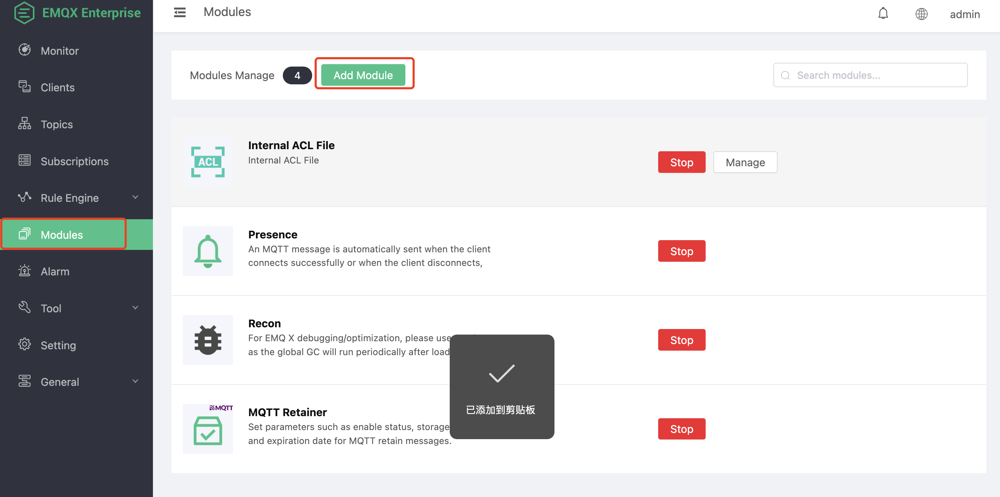

# Watsons Module

## 打开 EMQX Dashboard

注意：打开 EMQX 的 Dashboard ，并非 SDES 的 Dashboard。

默认端口 `18083`，如果有端口映射或负载均衡，请咨询运维部署人员。

### 登陆 EMQX 后台管理 Dashboard

默认账号

```text
admin
```

默认密码

```text
public
```

EMQX 4.4 版本之后，第一次登陆会强制修改默认的账号密码，修改之后的密码无法再次获取，请妥善保管新密码。

### Module

在左侧导航栏找到 `Modules` ，点击进入后点击 `Add Module`。



点击 `Local Modules` 找到 `Watsons Server`。或者在右侧搜索栏输入 `Watsons Server`


点击 `Select`，进入模块配置。


配置参数

| Name | Type | Info |
| - | - | - |
| MySQL Server IP Port | String | MySQL 数据库地址与服务端口号 |
| MySQL Database Name | String | MySQL 数据库名 |
| MySQL User Name | String | MySQL 数据库登陆用户，必须有读写权限 |
| MySQL Password | String | MySQL 数据库登陆密码 |

点击 `Add` 按钮，插件启动时会从 MySQL 数据库中加载数据，并且也会初始化一些业务查询过程，根据 MySQL 性能以及网络速度，启动会较慢，一般需要 4 到 5 秒。

### 模块启动成功


### 模块注意事项

模块仅需启动一次，启动过程会在集群中自动同步。

### 配置持久化

方式 1 （不推荐）:

挂载 EMQX 持久化目录，目录位置为

```path
emqx/data/
```

此方法在服务器 IP 不变化的场景适用，当 IP 发生变化时，可能导致 EMQX 集群失败，数据恢复失败

方式 2 （推荐）:

通过备份数据，详情参考 `数据导入导出` (`Data import and export`) 章节
