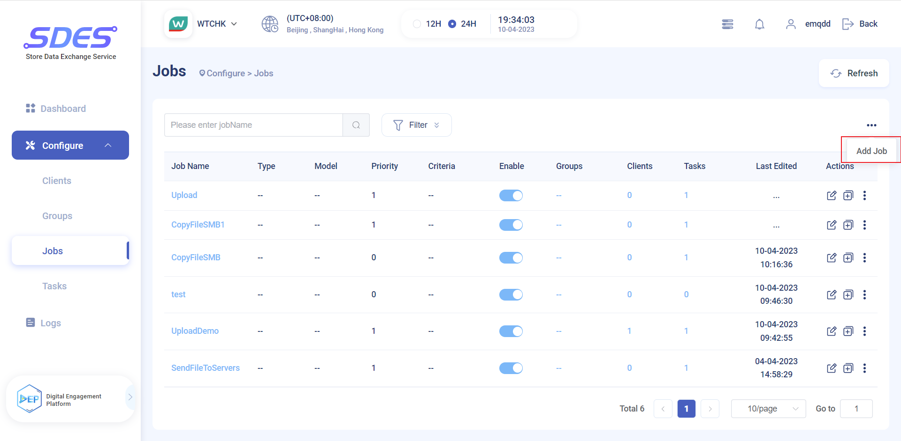
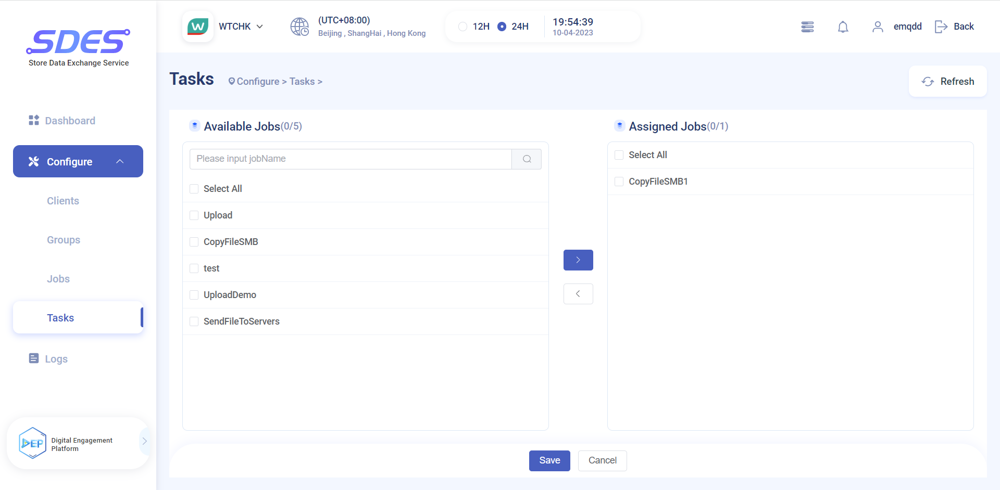

# EMQX & Watsons SDES Script - CopyFile

## 功能解释
## 配置方法
主要流程为：Add Job--->Add Task--->Edit Script
## 演示截图
添加 Job

配置 Job 的相关配置项，需要配置 `Job Start Times` `Priority` `Max Retries` `Retry Wait `等

配置完成 Job 后，添加并配置 Task，Task 添加成功后选择添加job,选择刚才的创建好的 Job。

然后需要配置 Script,设置`Target Path` 和 `File Path` 。

