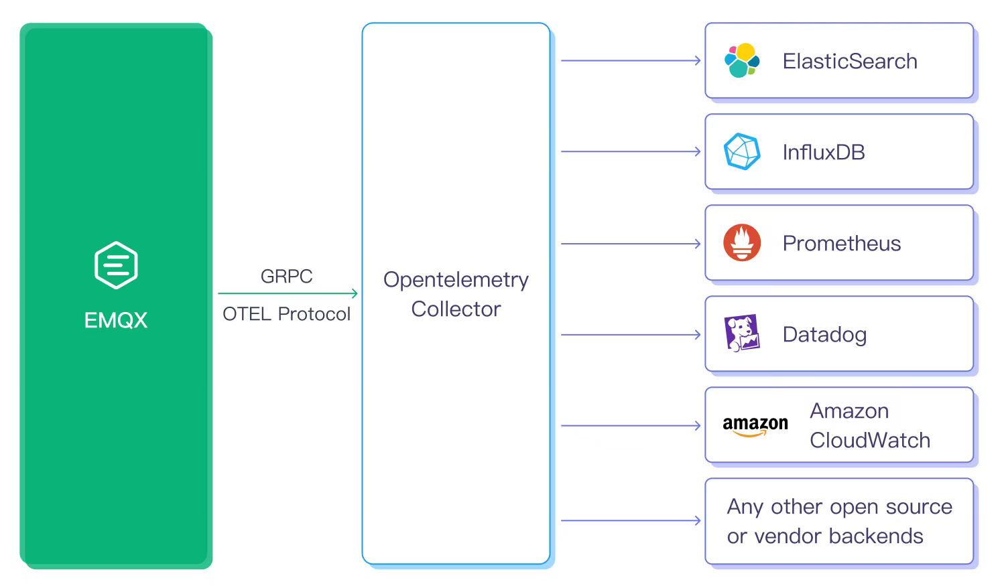
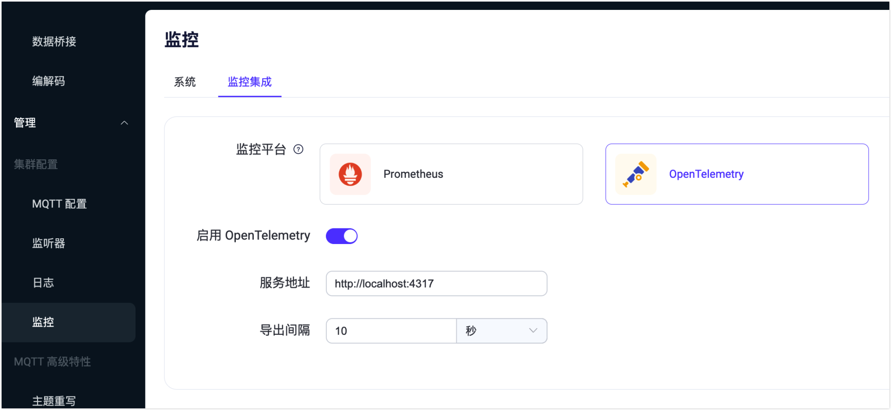

# 集成 OpenTelemetry

[OpenTelemetry](https://opentelemetry.io/docs/what-is-opentelemetry/) 是一个用于管理 metrics、 traces 和 logs 等遥测数据的可观测性框架。它提供了一套标准的 API 和约定，帮助开发人员在应用程序中生成遥测数据，并将其发送到后端存储和可视化工具。

EMQX 支持通过 gRPC OTEL 协议直接把遥测数据推送到 OpenTelemetry Collector，再经 Collector 中转/过滤/转换到任意你想要集成的后台中作存储和可视化，例如 Jaeger 和 Prometheus。通过与 OpenTelemetry 集成，可以优化 EMQX 的指标收集、消息发布的分布式追踪以及日志的统一收集与上下文关联。这种集成能够帮助用户实现 EMQX 的可视化监控和告警通知，跟踪消息在不同系统和服务之间的流动。这对于持续性能优化、更快地定位问题和进行系统监控有很大的帮助。

本页介绍了如何在 EMQX Dashboard 中配置 EMQX 与 OpenTelemetry 的集成，然后通过 [Prometheus](./open-telemetry.md) 查看 EMQX 指标。



<!-- TODO - 补充使用步骤，Dashboard 更新后截图 -->

## 前期准备工作

在集成 Opentelemetry 之前，您需要先部署和配置 OpenTelemetry 以及 Prometheus。

- 部署 [OpenTelemetry Collector](https://opentelemetry.io/docs/collector/getting-started)。
- 配置 Collector gRPC 接收端口（端口默认为 4317 ），及导出为 Prometheus Metrics 的端口（8889）。

```yaml
# otel-collector-config.yaml
receivers:
  otlp:
    protocols:
      grpc:

exporters:
  prometheus:
    endpoint: "0.0.0.0:8889"
      
processors:
  batch:
  
service:  
  pipelines:    
    metrics:
      receivers: [otlp]
      processors: [batch]
      exporters: [prometheus]
```

- 部署 [Prometheus](https://prometheus.io/docs/prometheus/latest/installation)。
- 配置 Prometheus 拉取 Collector 收集的指标。

```yaml
# prometheus.yaml
scrape_configs:
  - job_name: 'otel-collector'
    scrape_interval: 10s
    static_configs:
      - targets: ['otel-collector:8889'] # emqx metrics
      - targets: ['otel-collector:8888'] # collector metrics
```

## 通过 Dashboard 配置集成

您可在 EMQX Dashboard 设置集成 OpenTelemetry。点击左侧导航目录中的**管理** -> **监控**，在**监控集成**页签，设置启用 OpenTelemetry。



- 服务地址： OpenTelemetry Collector 的 gRPC 端口地址，默认为`http://localhost:4317`
- 导出间隔：周期性推送指标到 Collector 的时间间隔，默认为 10 秒。

## 通过 Prometheus 查看 EMQX 指标

通过 Prometheus 的控制台（`http://otel-collector:9090`）可以查看到 EMQX 指标：


